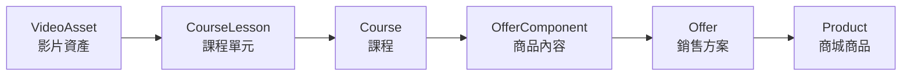
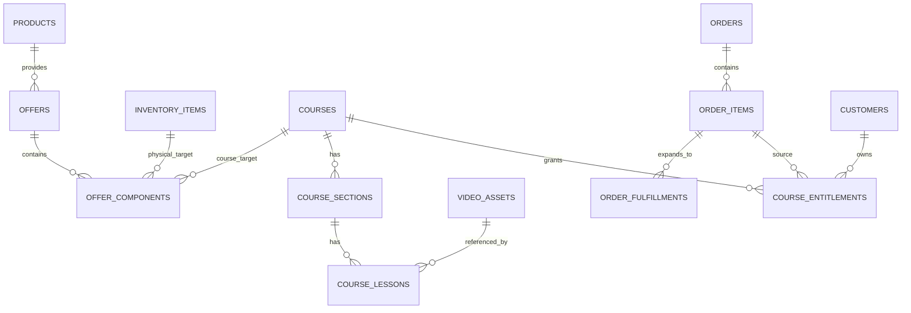
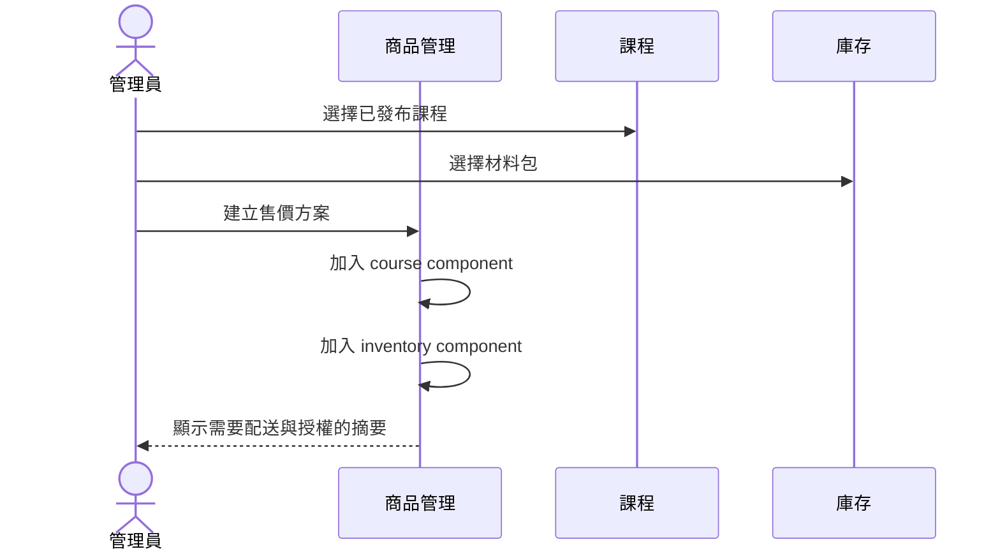
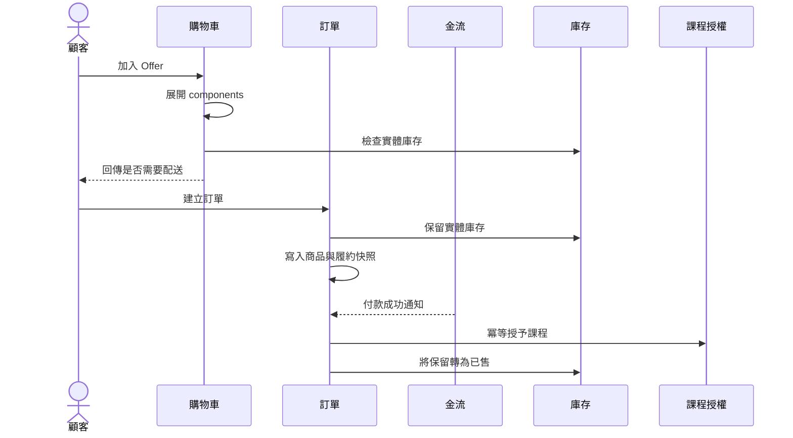

# Phase 0：商城與線上課程領域模型設計

日期：2026-07-29

## 原始需求

Luma Studio 現有商城以「商品必須先建立規格」為前提，但實際營運需求包含：

- 沒有規格的單一實體商品。
- 沒有規格的單一線上課程。
- 有尺寸、顏色、觀看期限或材料包差異的多方案商品。
- 一個商品同時提供課程觀看權與需要寄送的實體材料。
- 多門課程組合、多個實體品組合，以及數位與實體混合組合。
- 付款後，會員可以在「我的課程」觀看已購買內容。
- 課程影片存放於 private R2，只有已登入且具有效授權的會員可以播放。

本階段不是直接實作功能，而是先定義所有後續階段共同遵守的領域邊界、名詞、
資料關係與狀態規則，避免商品、購物車、訂單、影片與課程各自發展出不相容的模型。

## 需求理解

### 商品、方案、規格不是同一件事

- **商品（Product）**：商城展示頁，負責名稱、描述、圖片、分類與 SEO。
- **銷售方案（Offer）**：真正可以定價、加入購物車與形成訂單的單位。
- **規格選項（Option）**：顧客需要選擇時才出現，例如尺寸或觀看期限。

每個可販售商品至少要有一個 Offer，但不代表後台使用者必須新增規格。沒有規格的
商品由系統自動維護一筆不顯示名稱的 default Offer。

### 課程不是商品

課程負責教學結構；商品負責販售。兩者使用組合關係連接：

- 同一門課程可以單獨販售，也可以出現在不同材料包或課程組合中。
- 同一商品可以授予一門或多門課程。
- 修改商品價格不應修改課程內容。
- 下架商品不應移除既有會員的課程觀看權。

### 影片不是課程

影片是可重複使用的媒體資產。課程單元引用影片，而不是把影片本身當成課程：

### 配送需求由內容推導

不使用 `product_type = physical | digital | hybrid` 決定結帳流程。系統將購物車中的
Offer 展開成內容，只要存在任何實體庫存品，就需要配送；全部都是課程時則不需要。

## 領域邊界

| 領域 | 負責 | 不負責 |
| --- | --- | --- |
| Catalog | 商品頁、價格方案、規格選項 | 庫存扣減、課程播放 |
| Inventory | SKU、可用數量、保留與回補 | 商城文案、課程權限 |
| Course | 章節、單元、HTML、影片引用 | 售價、運費、訂單 |
| Video | 原始檔、轉檔、HLS、縮圖 | 課程章節、購買權 |
| Cart | 驗算方案、數量、價格、可用性 | 永久保存訂單 |
| Order | 購買快照、付款狀態、履約快照 | 動態讀取目前商品文案 |
| Fulfillment | 實體出貨與數位授權 | 付款金額計算 |
| Entitlement | 會員是否有權觀看課程 | 影片轉檔 |

## 核心資料模型

### 商城

| 實體 | 主要欄位 | 說明 |
| --- | --- | --- |
| `products` | `id`, `slug`, `title`, `description`, `status` | 商城展示內容 |
| `offers` | `id`, `product_id`, `title`, `price`, `is_default`, `enabled` | 可購買單位 |
| `offer_options` | `offer_id`, `group_name`, `value` | 顧客可見的規格值，選配 |
| `offer_components` | `offer_id`, `component_type`, `component_id`, `quantity`, `access_days` | Offer 實際交付內容 |

現有 `product_variants` 在初期可以繼續作為 Offer 的實體資料表，程式與介面先改用
Offer 語意；是否實體改名由 migration 成本另行決定。

### 實體庫存

| 實體 | 主要欄位 | 說明 |
| --- | --- | --- |
| `inventory_items` | `id`, `sku`, `title`, `stock`, `enabled` | 真正被扣庫存的實體品 |
| `inventory_reservations` | `order_id`, `inventory_item_id`, `quantity`, `expires_at` | 未付款訂單的庫存保留 |

一個材料包可以不出現在商城，但仍是 `inventory_item`。若它也要單獨販售，另一個
Offer 可以引用同一筆庫存，因此所有販售入口共享正確庫存。

### 課程與影片

| 實體 | 主要欄位 | 說明 |
| --- | --- | --- |
| `video_assets` | `id`, `source_key`, `master_key`, `status`, `duration_seconds` | R2 影片與轉檔狀態 |
| `courses` | `id`, `slug`, `title`, `status`, `summary` | 課程主體 |
| `course_sections` | `id`, `course_id`, `title`, `position` | 章節 |
| `course_lessons` | `id`, `section_id`, `title`, `content_html`, `video_asset_id`, `position` | 單元 |
| `course_entitlements` | `customer_id`, `course_id`, `source_order_item_id`, `granted_at`, `expires_at`, `revoked_at` | 觀看權 |

### 訂單與履約

| 實體 | 主要欄位 | 說明 |
| --- | --- | --- |
| `orders` | 金額、付款、配送與收件快照 | 一次交易 |
| `order_items` | 商品、方案、價格、數量快照 | 顧客買了什麼 |
| `order_fulfillments` | 類型、目標、數量、狀態快照 | 系統實際要授權或寄送什麼 |

`order_items` 不在事後重新展開目前的 Offer，因為商品內容可能已經改變。建立訂單時
就要把所有 component 寫入 `order_fulfillments`。

## 關係圖

## 主要流程

### 建立並販售混合商品

### 購買、付款與履約

## 必須維持的不變條件

1. 商品上架時至少有一筆 enabled Offer。
2. default Offer 不得與公開規格選項同時被當成額外選項顯示。
3. Offer component 不得形成循環。
4. 課程 component 的數量對同一會員採集合語意，不重複建立觀看權。
5. 實體 component 的數量會乘上購物車數量。
6. 訂單建立後，商品改名、改價或改內容不得改變訂單快照。
7. 只有付款成功才能授予課程；付款通知重送不得重複授權。
8. 只有存在實體 component 的訂單才需要配送。
9. 已售出的課程商品下架後，既有 entitlement 仍然有效。
10. private R2 key 永遠不直接成為公開的課程觀看 URL。

## 取捨與不採用方案

### 不採用固定商品類型

`physical | digital | hybrid | bundle` 會快速產生組合爆炸，例如「多課程＋兩個實體品」
又需要新的類型。商品內容組合可以從資料本身推導能力，不需要持續增加 enum。

### 不把價格同時存於 Product 與 Offer

單一商品後台可以把售價顯示在商品基本欄位，但資料庫仍只保留 Offer 價格。否則
單一方案切換成多方案時會有兩份價格來源。

### 不用巨大庫存數字代表數位商品

純課程應使用沒有實體 inventory component 的方式表示無限供應，而不是填入
`999999`。巨大數字會污染低庫存提示、訂單保留與回補邏輯。

### 不直接從訂單反推觀看權

獨立 entitlement 可以處理到期、撤銷、管理員補發、退款與未來的贈送課程；每次
播放掃描歷史訂單既慢，也無法清楚表達例外狀態。

## 本階段不做

- 不建立正式資料表 migration。
- 不改商品、購物車或結帳行為。
- 不上傳或轉檔影片。
- 不公開課程商品。
- 不實作播放器或 DRM。
