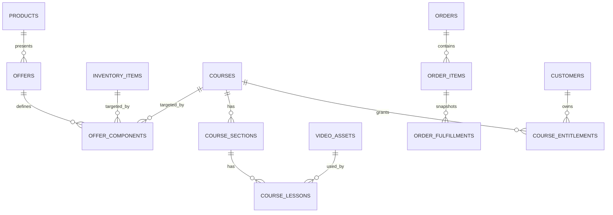

# Phase 0：商城與線上課程共同領域模型設計

日期：2026-07-29

## 結論與範圍

本文件只收斂 Phase 1–7 的契約；不建立資料表、不改 API、不部署。以下標籤不可混用：

- **已驗證事實**：目前 repo 的程式或 migration 已存在的行為。
- **設計決策**：後續 phase 應遵守的技術契約，不表示功能已實作。
- **待決策**：必須由產品／營運決定；本文不把建議當成既定事實。

## 已驗證的商城現況

| 主題 | 已驗證事實 | 證據 |
| --- | --- | --- |
| Schema | `products`、`product_variants` 由 migration `0007_create_shop` 建立；產品 slug 唯一，`(status, position)` 與 `(product_id, position)` 有索引。variant 欄位為 `title`、`sku`、`price`、`stock`、`position`、`enabled`，沒有 FK、SKU unique 或 default 標記。 | `backend/src/shared/migrations.py:131-161` |
| 訂單／會員／配送 | `shipping_methods` 的 PK 是 `method`，有 `enabled/fee/free_threshold/position`；`customers` 的 Google subject 唯一、email 索引；`orders` 與 `order_items` 保存收件與價格快照，並有 customer、status/reserved_until、order-item 索引。 | `backend/src/shared/migrations.py:175-193`, `205-285` |
| 商品管理 | `POST /api/products` 只建立 Product；variant 是另一個 `POST /api/products/{id}/variants`。產品更新可直接設為 active；目前沒有後端拒絕「active 但 0 enabled variant」。 | `backend/src/api/admin/shop.py:161-173`, `202-230`; `backend/src/domain/shop.py:246-253`, `321-337` |
| 管理 UI | 建立畫面只收 Product 欄位；編輯畫面另有「規格與庫存」並提示 active 商品可以沒有可販售規格。 | `frontend/src/admin/pages/ProductCreatePage.tsx:14-58`, `ProductEditPage.tsx:223-243` |
| 公開目錄 | 公開列表僅列 active Product；詳情僅回 enabled variants。可購買性目前是 `enabled && stock > 0`，並將低庫存數量限制在 5 以下才公開。 | `backend/src/api/front/pages.py:9-12`, `83-91`; `backend/src/domain/shop.py:166-213` |
| 價格／SKU／庫存 | 現況唯一價格與庫存來源皆為 `product_variants`；SKU 可空且未唯一。價格限制為 1–20,000、庫存 0–100,000。 | `backend/src/domain/shop.py:36-42`, `101-106`, `143-153` |
| Cart | localStorage key 是 `luma-cart`，格式只有 `[{variantId, quantity}]`，沒有 TTL。伺服器每次依 variant 重算價格、商品狀態、庫存與小計。 | `frontend/src/storefront/lib/cart.ts:10-27`, `33-60`; `backend/src/domain/cart.py:33-63`, `66-122` |
| Cart API | `POST /api/cart/validate` 回 `lines/problems/subtotal/shipping`；`problems` 為 unavailable/out_of_stock/reduced。運費以整個 `subtotal` 報價，沒有 `requiresShipping` 或 `shippingSubtotal`。 | `backend/src/api/front/checkout.py:12-27`; `frontend/src/shared/contracts/cart.ts:1-32` |
| Checkout | 現況一律要求 shipping method、姓名、手機、email；宅配另要求地址。超商只接受 `cvs_c2c`，UI 明說門市在未來付款頁選取，後端目前不接收／保存門市選擇。 | `backend/src/api/front/checkout.py:50-78`; `backend/src/domain/orders.py:52-83`; `frontend/src/storefront/pages/CheckoutPage.tsx:124-188` |
| 庫存保留 | 建單時以 `UPDATE product_variants ... stock >= quantity` 條件扣庫存；多 line 中途失敗會逐筆回補。pending 訂單保留 15 分鐘，public Worker cron 每 5 分鐘將逾期訂單改 expired 並回補。 | `backend/src/domain/orders.py:1-12`, `179-263`, `564-590`; `backend/wrangler.toml:72-76`; `backend/src/main.py:226-233` |
| 付款與狀態 | 尚無 PAYUNi callback 或正式 payment attempt 建立路徑。唯一付款轉移為條件式 `pending -> paid`；開發 fake-payment 預設關閉，管理員可 `POST /api/orders/{id}/paid`。重送同一路徑不會重複轉移。 | `backend/src/domain/orders.py:349-370`, `373-428`; `backend/src/api/front/checkout.py:114-126`; `backend/src/api/admin/orders.py:123-153`; `backend/wrangler.toml:78-81` |
| Audit | 建單、paid、shipped、completed、cancelled、expired、note 寫 `order_audit_log`；可前進狀態為 `pending -> paid -> shipped -> completed`，取消可由 holding 狀態進入。 | `backend/src/shared/migrations.py:286-299`; `backend/src/domain/orders.py:172-176`, `373-428`, `546-590` |
| 部署／migration | Admin Worker 是唯一 migration 執行者，public Worker 只讀 migration 名稱；admin 先部署，public 後部署。migration 在 admin request 進入 router 時執行，失敗回 503。 | `backend/src/shared/router.py:32-59`; `backend/src/admin_main.py:104-106`; `backend/src/main.py:23-26`, `226-231`; `README.md:16-20` |
| 現有測試 | Cart 有 parse、重算、庫存／停售與運費門檻；orders 有條件扣庫存、回補、付款冪等、狀態；checkout 有 profile 行為；前端有商品頁與 cart 型別／元件測試，但沒有課程、Offer component、entitlement 或正式金流 callback 測試。 | `backend/tests/test_cart.py:32-205`; `backend/tests/test_orders.py:100-216`; `backend/tests/test_checkout_profile.py:57-100`; `frontend/src/storefront/pages/ProductPage.test.ts` |

### 對原假設的校正

1. **不是**「商品必須先建立規格」：目前 Product 可先建立，卻無法販售；真正缺的是可販售的 default Offer 建立契約。
2. **不是**「現有付款通知已重送」：只有 `mark_paid` 的條件更新提供可重入基礎，正式金流 callback 尚未存在。
3. **不是**「超商資料目前已完整收集」：schema 有 store 欄位，但 checkout request／建立訂單未寫入。
4. **不是**「SKU 已唯一」：目前允許空白與重複 SKU。新的 InventoryItem 若採 SKU unique，必須先處理既有重複／空白資料。
5. **不是**「product_variants 可直接安全刪除」：目前刪除不檢查 pending order；Phase 1 起需先保留／停用，再由引用規則控制硬刪。

## 目標領域模型（設計決策）

| 概念 | 責任 | 與現況／後續關係 |
| --- | --- | --- |
| Product | 商城展示：slug、文案、圖片、分類、上架狀態。 | 保留現有 `products`。不得持有另一份 price/stock。 |
| Offer | 唯一可定價、加入 Cart、產生 OrderItem 的銷售單位。 | Phase 1 暫以 `product_variants` 承擔；API 才逐步引入 Offer 語意。 |
| Option | 顧客可見且需要選擇的 Offer 差異。 | 第一版由非 default Offer 的 title 表示；不要新增與 Offer 重複的真值表。若日後需要多維選項，再新建 option group/value 並保持 Offer 為可買單位。 |
| InventoryItem | 可共享、可保留、可扣減的實體庫存權威。 | Phase 2 取代 `product_variants.stock` 的寫入權。 |
| OfferComponent | Offer 的平坦履約定義：course 或 inventory。 | 只能指向 Course／InventoryItem，不能指向 Offer，故不會有 bundle 遞迴。 |
| Course | 可授予的教學主體與章節／單元。 | 不持有售價、庫存或運費。 |
| VideoAsset | private R2 影片的上傳／轉檔資產。 | Lesson 引用資產；公開 API 不回 private key。 |
| OrderFulfillment | 已下單的 component 履約快照與履約狀態。 | 不重新展開目前 Offer。 |
| Entitlement | Customer 對 Course 的有效觀看權。 | 付款後由 course fulfillment 冪等建立，不能在播放時掃歷史訂單。 |



### Offer、default Offer 與舊 variantId（設計決策）

- Phase 1 將既有 `product_variants.id` 視為 `offerId` 的相同 ID，先不改實體表名；這讓舊 cart 的 `variantId` 與舊 order 的 `variant_id` 均可解析。
- 單一可販售 Offer 要設 `is_default=1`。其 title 的儲存值可為空字串，公開 API 回 `title: null`／`requiresOfferSelection: false`，前端不可用文案判斷。
- 一個 Product 最多一個 default Offer；有多個公開 Offer 時，default 不得同時作為額外選項。Product active 前必須有至少一個 enabled Offer；這是新契約，現況尚未強制。
- `variantId` 與 `offerId` 過渡期都可收；伺服器正規化為同一 Offer ID，兩者同傳但不同時回 400。localStorage 的讀取相容期不能以「一週」猜測；至少跨一個已發布前端版本與觀察期後才移除 variant 欄位。

### 庫存遷移與一致性（設計決策）

1. Phase 2 新增 `inventory_items`、`offer_components`，以固定／可追查的 mapping 為每一個既有 variant 回填一筆 InventoryItem 與 quantity=1 inventory component。
2. 回填前先報告空白 SKU、重複 SKU、負值（雖現有 API 拒絕，既有 D1 仍需查）；SKU 非空 unique 只能在清理後啟用。
3. 新讀取路徑上線前逐列比對 `variant.stock == inventory_item.stock` 與 component 關係。切換後只有 InventoryItem 可被管理調整、reserve、release；`product_variants.stock` 僅作 rollback 相容讀取，不得長期雙寫。
4. 由於目前實作未使用 D1 batch 且以條件 UPDATE＋補償維護庫存，Phase 3 多 InventoryItem 的 reserve 也必須記錄「已扣清單」，任一失敗就逐筆回補；不可先相信 cart 的個別可買結果。

### Cart、Order、snapshot 與履約（設計決策）

`resolve_offer(offer_id, purchase_quantity)` 是 Phase 2 唯一展開入口；Cart quote 與建立訂單都必須呼叫它。它驗證 Product active、Offer enabled、component target 存在且可用，並回傳價格、`containsCourse`、`requiresShipping`、及 inventory 的 `requiredQuantity = component.quantity × purchase_quantity`。

| 快照 | 必存欄位 | 不可從現況重算的原因 |
| --- | --- | --- |
| OrderItem | product/offer ID、Product/Offer 顯示名稱、unit price、quantity、subtotal、containsCourse、requiresShipping | 名稱、價格、上架狀態會變。 |
| OrderFulfillment (course) | order/order-item ID、Course ID、Course title、access_days、quantity=1、status | Offer 之後可換課程或期限。 |
| OrderFulfillment (inventory) | order/order-item ID、InventoryItem ID、title、SKU、required quantity、status | SKU／名稱與 component 數量會變。 |
| Order | 既有金額與 recipient snapshot；純數位應保存 `shipping_method='none'` 與空地址，而非假配送方式。 | 收件／費用是交易快照。 |

```mermaid
sequenceDiagram
    participant Browser
    participant Cart as CartQuote
    participant Order as Order service
    participant Inventory
    participant Payment
    participant Fulfillment
    Browser->>Cart: lines (variantId or offerId)
    Cart->>Cart: normalize and resolve_offer
    Cart-->>Browser: price, components, requiresShipping
    Browser->>Order: checkout lines + recipient data
    Order->>Order: re-resolve; do not trust quote/totals
    Order->>Inventory: conditional reserve aggregated requirements
    Order->>Order: write OrderItem + fulfillment snapshots
    Payment->>Order: mark_paid once
    Order->>Fulfillment: provision_paid_order, retryable
    Fulfillment->>Fulfillment: INSERT OR IGNORE Entitlement per provision key
```

配送由所有 resolved components 推導：存在任一 inventory component 才 `requiresShipping=true`。純數位不提供 shipping options，也不要求電話、地址或門市；有實體則沿用現有 home/cvs 驗證，並在正式金流／物流串接前補齊 cvs store snapshot。混合 Offer 的運費基數是待決策（見下），不可沿用現況「所有 subtotal」而不標記差異。

### Entitlement 與付款（設計決策）

- `mark_paid`、未來 gateway callback、管理員手動標記、reconciliation 必須共用 `provision_paid_order(order_id)`；付款狀態轉移維持條件更新。
- entitlement 的存取身份為 `(customer_id, course_id)`；另以 `course_entitlement_sources` 記錄每個 `source_order_fulfillment_id`，其唯一鍵作為付款事件的 provision key。如此同一會員同一門課只有一筆有效 entitlement，但每個購買來源仍可稽核。建立 entitlement／source 時均須冪等；重複購買是否延長期限不是隱含行為，須另訂 policy。
- 若 paid 已成功但 provision 失敗，Order 保持 paid，course fulfillment 留 pending，排程／管理 reconciliation 重跑；不得將付款 callback 當成唯一執行機會。
- 付款前取消／逾期只回補 inventory fulfillment；課程 entitlement 尚未建立。退款、chargeback、已付款取消的 entitlement 政策為待決策。

### polymorphic OfferComponent 的 D1 驗證（設計決策）

D1 一般 FK 不能同時指向兩張 target table。寫入 component 的 domain service 必須在同一儲存邊界前驗證：`component_type ∈ {course, inventory}`、目標存在、course 為 published（供啟用 Offer）、inventory enabled、quantity/access_days 的 type-specific 約束、同 Offer/type/target 不重複、position 正規化。刪除／封存 target 前要查 component、Lesson、OrderFulfillment、Entitlement 引用並拒絕硬刪或改封存。

## 五個代表案例（設計決策）

| 案例 | Product／Offer／Component | 商品頁與 Cart | 配送／庫存 | Order snapshot、付款後、取消／逾期、會員結果 |
| --- | --- | --- | --- |
| 單一實體 | Product「畫筆」；default Offer（原 variant ID）；inventory component: Brush ×1。 | 無規格選擇，直接加入；Cart resolve 後顯示單一 line。 | 需要配送；reserve/sell/release Brush。 | Item 快照 Offer 價格；inventory fulfillment 含 SKU/數量，paid 後待出貨；取消／逾期回補 Brush；無 entitlement。 |
| 多規格實體 | Product「T-shirt」；Offer S/M/L；各自 component 指向其 InventoryItem ×1。 | 顯示 Offer 選項；Cart 保留 selected offer ID。 | 需要配送；彙總各 Item 需求。 | Item 保存選項名；inventory fulfillment 各自 snapshot；取消／逾期回補對應 Item；無 entitlement。 |
| 單一純課程 | Product「水彩入門」；default Offer；course component Course A ×1、access_days 依方案。 | 無規格選擇；Cart quote 不回 shipping。 | 不配送、不扣庫存。 | Item 與 course fulfillment 保存 Course title/期限；paid 後建立 entitlement；取消／逾期無庫存回補；會員取得 Course A。 |
| 課程＋材料包 | Product「水彩完整套組」；default Offer；Course A ×1 + Kit ×1。 | 商品頁列出課程與材料；Cart quote 顯示配送。 | 需要配送；只 reserve Kit。 | 一個 Item、兩種 fulfillment；付款後 entitlement 與待出貨；未付款取消／逾期只回補 Kit；會員取得 Course A。開課時點為待決策。 |
| 多門課程組合 | Product「花卉組合」；default Offer；Course A/B/C 各 ×1。 | 顯示「此方案包含」三門課；Cart 不回 shipping。 | 不配送、不扣庫存。 | 一個 Item、三筆 course fulfillment；paid 後對每 Course idempotent provision；取消／逾期無庫存回補；會員取得 A/B/C。 |

## 待決策（產品／營運 owner）

| 議題 | 可行選項與影響 | 建議（非既定事實） |
| --- | --- | --- |
| 退款後撤銷權限 | A 撤銷 entitlement；B 不撤銷；C 依觀看／退款原因人工決定。A 需 revoke reason/audit 與短 token 生效窗口；B 無播放變更；C 需營運 action。 | C，保留 A/B 可設定的 policy，避免自動沒收已觀看課程。 |
| 混合商品何時開課 | A paid 立即；B shipped；C delivered。A 要接受材料延遲仍可學；B/C 需 digital fulfillment 等待 physical 狀態。 | A，將數位與實體履約解耦。 |
| 預設觀看期限 | A 永久 (`expires_at NULL`)；B 固定天數；C Offer 必填期限。影響 entitlement 計算與到期 UX。 | A，期限型 Offer 再填 `access_days`。 |
| 含課程 Offer 數量 | A 固定 1；B 允許多件但同帳號集合授權；C recipient／gift 流程。B 會有付多份卻只得一份的歧義。 | A；贈送另建 recipient entitlement。 |
| 混合商品免運門檻 | A 全 Offer 售價；B 只實體可歸屬金額；C Offer 設 shipping contribution。A 不需拆價但數位抬高門檻；B/C 需新欄位或分配規則。 | A 作為初版透明規則，並在 UI 明示。 |
| 純數位 paid 後整體狀態 | A 自動 completed；B 維持 paid 並以 digital fulfillment 顯示 fulfilled。A 需擴充目前 `paid -> shipped -> completed`；B 需前端語意。 | A，但只在全部 digital fulfillment 成功後轉移。 |
| Course archived 與既有會員 | A 可繼續看；B 全部停用；C 有到期寬限。影響 learning query 與 archive UX。 | A，封存只阻止新販售。 |
| 未來贈送課程 | A 新 entitlement source=`manual/gift`；B 以零元 OrderItem；C recipient checkout。A 要擴充 source／audit，不污染訂單。 | A，另案實作。 |

## 跨 phase 交接

- **Phase 1**：只引入 Offer 語意、`is_default` 與 single/multi UI，相容 `variantId`；不得處理課程或 InventoryItem。
- **Phase 2**：建立 InventoryItem、Course skeleton、OfferComponent 與可重跑 backfill；切換庫存唯一寫入來源。
- **Phase 3**：以共享 `resolve_offer` 改 Cart／Checkout／OrderFulfillment／Entitlement provision；先取得上述商業決策。
- **Phase 4–6**：VideoAsset、Course authoring、Learning 僅透過 Course／Entitlement 契約連接，不可把 R2 key 塞入 Product 或 Cart。
- **Phase 7**：清理舊 variant/localStorage 相容層前，需確認 backfill、舊 request 觀察期、rollback 版本與 runbook。
