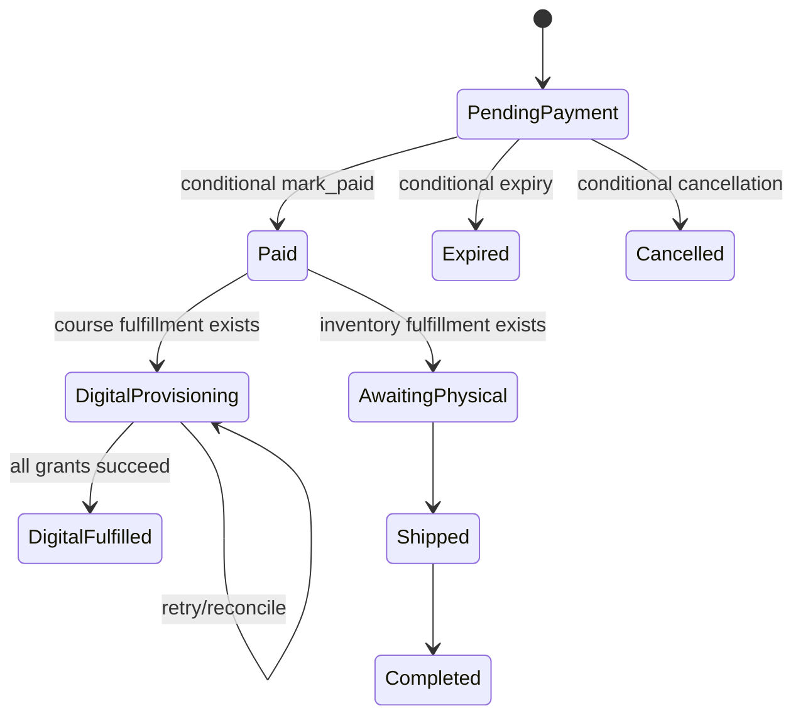

# Phase 0 規格：商城與課程共同架構

## 規格地位

本文件是 Phase 1–7 的設計契約，不是現行 schema。現行 schema 的事實以
`backend/src/shared/migrations.py:136-299` 為準；任何與本文件衝突之處，必須先以 additive migration 與相容 API 消化，不能假設資料庫已存在新欄位。

## 名詞與不變條件

```text
OfferId = 現行 product_variants.id（Phase 1 過渡期）或未來 offers.id
ComponentType = "course" | "inventory"
CourseStatus = "draft" | "published" | "archived"
VideoAssetStatus = "uploading" | "uploaded" | "queued" | "processing" | "ready" | "failed" | "aborted" | "archived"
FulfillmentStatus = "pending" | "ready" | "fulfilled" | "cancelled" | "revoked"
Entitlement active = revoked_at IS NULL AND (expires_at IS NULL OR expires_at > now)
```

1. Product 只展示；Offer 才能定價與購買；InventoryItem 才能有可扣庫存；Course 才能授權觀看。
2. 一個 active Product 至少一個 enabled Offer；每 Product 至多一個 `is_default=1`。
3. 不建立 `product_type`。`containsCourse`、`containsPhysicalItem`、`requiresShipping`、`digitalOnly` 只能由 resolve result 推導，客戶端不可提交，資料庫不可重複存為真值。
4. Component 平坦，只能指 Course 或 InventoryItem；Offer 不可作為 component target。
5. 建單時寫不可變 Item／Fulfillment snapshots；付款後不得重新讀目前 Offer 重算交付內容。
6. 一個 Course component 的 quantity 固定 1；inventory required quantity 為 component quantity × purchase quantity。
7. 付款成功、管理員人工標記、未來 gateway callback、reconciliation 共用 provision 入口；所有入口可安全重送。

## 候選 schema 與索引

### Phase 1：Offer alias（沿用 `product_variants`）

現行 `title TEXT NOT NULL`、`price INTEGER NOT NULL`、`stock INTEGER NOT NULL` 見
`backend/src/shared/migrations.py:151-161`。Phase 1 只新增：

| 欄位／索引 | 規格 |
| --- | --- |
| `is_default INTEGER NOT NULL DEFAULT 0` | 0/1；單一 Offer 商品為 1。 |
| unique default | `CREATE UNIQUE INDEX ... ON product_variants(product_id) WHERE is_default = 1`；若 D1 環境不採 partial index，API 必須在同一寫入邊界保證。 |
| title | default 的 DB 值使用 `''`，對外回 `null` 或省略；公開 multi Offer 必填且非空。 |
| price／SKU／stock | Phase 1 維持既有 variant 欄位與驗證；price 不能為 0（現行規則為 1–20,000），SKU 不先宣稱唯一，stock 仍是暫時權威。 |

Phase 1 不新增 `offers` 表，避免把同一 Offer 的 ID、價格或庫存拆成雙來源。`offerId` 是 API 名詞，值等於 `variantId`。

### Phase 2：Inventory 與 components

| Table | 欄位 | 約束／索引 |
| --- | --- | --- |
| `inventory_items` | `id PK, sku TEXT, title TEXT NOT NULL, stock INTEGER NOT NULL, enabled INTEGER NOT NULL, archived_at, created_at, updated_at` | stock >= 0；非空 SKU partial unique（backfill 清理後）；`(enabled,title)` picker；SKU／stock 將成為庫存唯一來源。 |
| `courses` | `id PK, slug TEXT NOT NULL, title TEXT NOT NULL, status TEXT NOT NULL, created_at, updated_at` | slug unique；status enum。Phase 5 additive 擴充。 |
| `offer_components` | `id PK, offer_id, component_type, component_id, quantity, access_days NULL, position, created_at, updated_at` | unique `(offer_id,component_type,component_id)`；`(offer_id,position)`；`(component_type,component_id)`。course quantity=1，access_days NULL/正整數；inventory quantity>0，access_days NULL。 |

`component_id` 為 polymorphic reference，不能只依賴 D1 schema：寫入、啟用 Offer、封存／刪除前均須在 application domain 驗證 type、target、引用與狀態。

### Phase 3：交易、履約與授權

| Table | 欄位 | 約束／索引 |
| --- | --- | --- |
| `order_items` additive | `product_id`, `offer_id`, `requires_shipping`, `contains_course`，保留 `variant_id` | 新單全填 `offer_id`；相容期 `variant_id == offer_id`。產品／Offer ID 是來源，顯示名與金額仍採既有 snapshot 欄位。 |
| `order_fulfillments` | `id PK, order_id, order_item_id, fulfillment_type, target_id, target_title, sku NULL, quantity, access_days NULL, status, created_at, updated_at` | `(order_id,fulfillment_type,status)` 操作索引；`(target_id,fulfillment_type)` 引用索引。target title/SKU/期限為 snapshot。 |
| `course_entitlements` | `id PK, customer_id, course_id, granted_at, expires_at NULL, revoked_at NULL, revoke_reason NULL, created_at, updated_at` | unique `(customer_id,course_id)`，保證會員對同一 Course 的存取採集合語意；有效查詢 `(customer_id,revoked_at,expires_at)`。 |
| `course_entitlement_sources` | `entitlement_id, source_kind, source_order_fulfillment_id NULL, actor NULL, created_at` | 購買來源 unique `(source_kind,source_order_fulfillment_id)`；手動／贈送不可偽造 order fulfillment，必填 actor/reason。 |

`inventory_reservations` 是可選的操作追蹤表，不是用來取代 `inventory_items.stock` 的第二份可用量。若建立，至少有 `order_id/inventory_item_id/quantity/status/expires_at`、unique `(order_id,inventory_item_id)`；唯一扣減仍是條件 `UPDATE inventory_items SET stock=stock-? WHERE stock>=?`。

## API shape 原則（不實作 endpoint）

### 相容輸入與公開輸出

```json
// 過渡 cart line：兩者都可傳；不同時為 400
{"variantId":"offer-1","offerId":"offer-1","quantity":1}

// 正規化後的 CartQuote 核心
{
  "lines":[{"offerId":"offer-1","productTitle":"...","offerTitle":null,"unitPrice":680,"quantity":1,"lineTotal":680,"components":[]}],
  "problems":[],
  "subtotal":680,
  "shippingSubtotal":680,
  "requiresShipping":true,
  "containsCourse":false,
  "shipping":[]
}
```

- Cart／Checkout 一律由伺服器 `resolve_offer` 重算 price、可買性、component、配送與庫存；拒絕或忽略 client subtotal、shipping fee、flags、component。
- Public Product detail 提供 `requiresOfferSelection` 與可買 Offers；default Offer 不顯示假名稱。不得回 private R2 key。
- Checkout request 對所有訂單要求登入與 email；`requiresShipping=false` 時不要求 shippingMethod／phone／address／store，並寫 `shipping_method='none'`；有實體時才驗證 home 地址或 cvs 門市快照。
- 管理 component API 只收 `{type, componentId, quantity, accessDays}` 的完整集合，不收衍生 flag、R2 key 或任意 target；先驗證全體再儲存。
- `mark_paid` 只負責一次 payment state transition；`provision_paid_order` 只根據已寫入 fulfillments 建 entitlement，兩者均可重跑且留 audit。

### 唯一計算位置

`resolve_offer(env, offer_id, purchase_quantity)` 是唯一展開函式，回傳 `ResolvedOffer`：

```text
offerId, productId, price, purchaseQuantity,
containsCourse, containsPhysicalItem, requiresShipping, digitalOnly,
components[{type,targetId,targetTitle,sku?,requiredQuantity?,accessDays?}]
```

Cart quote 聚合同 InventoryItem 的 `requiredQuantity` 再查庫存；Order create 再做一次相同解析與條件 reserve。不得存在一套 Cart 展開、一套 Checkout 展開。

## 狀態與補償



- reserve 的多品項流程：依穩定排序逐筆條件扣減、記錄成功清單；後續 reserve、Order、Item 或 Fulfillment 寫入失敗時，只回補成功清單。現況對 variant 的相同模式可見於 `backend/src/domain/orders.py:203-263`。
- 逾期／未付款取消只能釋放 physical InventoryItem。paid 後不增加／回補庫存，除非退款／退貨政策的明確 action。
- 對 `course_entitlement_sources` 的 `INSERT OR IGNORE` 成功或既存皆視為該 fulfillment provision 成功；entitlement 以 `(customer_id,course_id)` upsert。不得在 callback 重送時延長 `expires_at`。若將來要累加觀看期，需新增明確 policy 與 audit，而不是更新同一 key。
- payment、digital fulfillment、physical fulfillment 是獨立狀態。現行單一 `orders.status` 只能暫時表示顧客整體進度；Phase 3 必須在 Order detail 顯示 fulfillment 明細。

## migration、backfill、相容與 rollback 順序

1. **Admin-first schema deploy**：新增 migration 只放 `backend/src/shared/migrations.py`；部署 Admin Worker，確認 admin `/api/health` migration list；再部署 public Worker，確認其只讀 health list。這是既有 deployment contract（`backend/src/shared/router.py:32-56`）。
2. **Phase 1 additive**：新增 `is_default`，對「恰一筆 variant」標記 default，多筆維持非 default；不得猜測。舊 public／cart 仍讀 `variantId`。
3. **Phase 2 additive/backfill**：新增 inventory/course/component 表，建立 mapping 與 idempotent backfill。先產出 null/duplicate SKU 與 stock 對帳；未完成即不得切換權威庫存。
4. **讀取切換**：新 code 先能解析舊 offer IDs、用 compatibility adapter 讀 InventoryItem；切換後唯一寫入 InventoryItem，舊 `variant.stock` 不雙寫。
5. **Phase 3 writes**：先部署能讀新／舊 schema 的 public API，再開 feature flag 寫 fulfillments／entitlements；舊訂單不補造 course entitlement 或改寫金額。必要的 physical fulfillment backfill 只能新增 snapshot，不改既有 status。
6. **rollback**：每 phase 保留 additive columns/tables 與 old request reader；若新 deployment 出錯，關閉 course checkout flag、回到舊 variant 讀取路徑。不可 rollback DB 以刪欄位／刪表作為第一反應。
7. **清理**：只有已完成 inventory 對帳、production 無舊 request、至少一個已發布 rollback 版本能讀新 schema、觀察期與備份／還原 runbook 完成，才停止舊 API/localStorage／`variant.stock` 相容讀取。D1 可保留停用欄位。

## Phase 1 gate

Phase 1 可以開始，但須先將下列 gate 寫入 implementation plan／review：

- [ ] 確認 migration 使用 partial unique index 是否在目標 D1 migration 環境可驗證；否則明確採 API invariant 並以並發測試覆蓋。
- [ ] 定義 existing single-variant backfill、zero-variant active Product 的處理，以及 `active -> no enabled Offer` 的拒絕規則。
- [ ] 實作／測試 Product + default Offer 的一致性策略；現行 Python binding 沒有已驗證的 D1 batch 用法，需採已驗證的補償或在測試環境驗證 batch。
- [ ] 保留 `variantId` localStorage/API；明訂舊 key 移除前的版本與觀察期。

退款、混合開課、期限、數量、免運、純數位 completed、封存可看與 gifting 的待決策不阻擋只處理 Offer UI 的 Phase 1；它們阻擋 Phase 3 對課程 checkout／fulfillment 的公開啟用。
