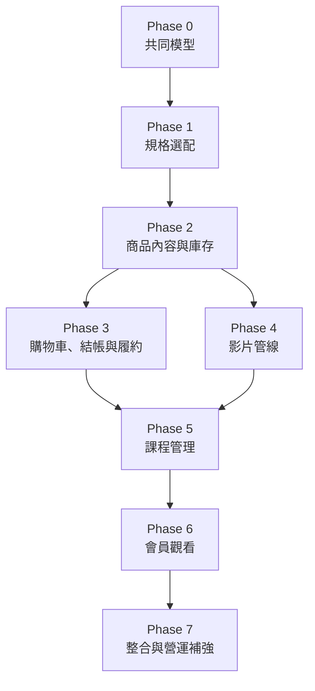

# Phase 0 規格：商城與課程共同架構

## 目標

產出 phase1～phase7 共用且不互相矛盾的領域契約，確認現有資料可以漸進遷移，
並把需要產品決策的問題在寫 migration 前定案。

## 架構原則

1. Catalog、Inventory、Course、Video、Order、Fulfillment、Entitlement 分離。
2. 對外的商品規格選配，內部的可購買 Offer 必備。
3. 商品是否需要配送由 component 推導。
4. 訂單保存不可變快照，履約不依賴目前商品設定。
5. 付款、庫存與授權操作必須可安全重試。
6. 每個 phase 的 migration 只向前新增或回填，不要求一次替換整個商城。

## 概念型別

```text
ComponentType = "course" | "inventory"
CourseStatus = "draft" | "published" | "archived"
VideoAssetStatus = "uploading" | "uploaded" | "processing" | "ready" | "failed"
EntitlementStatus = active when revoked_at is null and expires_at has not passed
FulfillmentStatus = "pending" | "ready" | "fulfilled" | "cancelled"
```

不建立 `ProductType`。若前端需要顯示標籤，API 由 components 回傳衍生值：

```text
digitalOnly
requiresShipping
containsCourse
containsPhysicalItem
```

## 資料表候選規格

### `offers`

| 欄位 | 型別 | 約束 |
| --- | --- | --- |
| `id` | TEXT | PK |
| `product_id` | TEXT | 必須存在 |
| `title` | TEXT | default Offer 可為空字串 |
| `price` | INTEGER | 新台幣整數且大於等於 0 |
| `is_default` | INTEGER | 每商品最多一筆 |
| `enabled` | INTEGER | 0 或 1 |
| `position` | INTEGER | 同商品內排序 |

若沿用 `product_variants`，上述欄位以 additive migration 加入，先保留現有 `sku` 與
`stock`，直到 phase2 完成 inventory backfill。

### `inventory_items`

| 欄位 | 型別 | 約束 |
| --- | --- | --- |
| `id` | TEXT | PK |
| `sku` | TEXT | 可空，非空時唯一 |
| `title` | TEXT | 不得為空 |
| `stock` | INTEGER | 大於等於 0 |
| `enabled` | INTEGER | 0 或 1 |
| `created_at` / `updated_at` | INTEGER | UTC Unix timestamp |

### `offer_components`

| 欄位 | 型別 | 約束 |
| --- | --- | --- |
| `id` | TEXT | PK |
| `offer_id` | TEXT | 必須存在 |
| `component_type` | TEXT | `course` 或 `inventory` |
| `component_id` | TEXT | 依 type 指向對應實體 |
| `quantity` | INTEGER | inventory 必須大於 0；course 固定 1 |
| `access_days` | INTEGER NULL | course 使用；NULL 表永久 |
| `position` | INTEGER | 顯示與展開順序 |

應建立 `(offer_id, component_type, component_id)` 唯一索引，避免相同內容重複加入。
D1 無法用一般 FK 表達 polymorphic reference，寫入 API 必須驗證目標存在與類型正確。

### `order_fulfillments`

除目標 id 外，也要保存標題、SKU、數量、授權天數等快照。即使原始課程或庫存品
封存，後台仍能解釋這筆訂單當時應交付什麼。

### `course_entitlements`

唯一鍵使用 `(customer_id, course_id, source_order_item_id)`。授權流程使用
`INSERT OR IGNORE`，並另設查詢索引 `(customer_id, revoked_at, expires_at)`。

## 跨階段依賴



Phase3 與 Phase4 在 phase2 契約穩定後可以獨立開發，但課程商品不得在 phase6 完成前
公開上架。

## 相容性策略

### 既有商品

每筆現有 `product_variants` 在 phase1 被視為 Offer。只有一筆 enabled variant 的
商品可以將該筆標記為 default；多筆則維持公開方案。

### 既有庫存

phase2 為每筆現有 variant 建立一個 `inventory_item` 和一筆 inventory component，
將 SKU 與庫存回填。切換讀取來源前必須比對兩邊總數與庫存值。

### 既有購物車

瀏覽器目前保存 `variantId`。API 過渡期同時接受 `variantId` 與 `offerId`，兩者不得
同時指向不同資料。完成前端部署與合理的購物車存活期間後，才能停止舊欄位。

### 既有訂單

既有 `order_items` 不補造課程或 bundle fulfillment；它們在新功能前全部是實體商品。
必要時可建立 physical fulfillment snapshot，但不得更改金額與歷史狀態。

## API 共通要求

- 管理 API 的 component 寫入只接受實體 id，不接受 R2 key 或前端提供的衍生旗標。
- 公開 API 不回傳 private object key。
- Cart quote 必須由伺服器重算價格、內容、庫存與配送需求。
- 建立訂單必須重新執行與 cart quote 相同的解析，不信任瀏覽器回傳的總額或旗標。
- 付款通知、重試付款與管理員手動標記付款必須走同一個授權入口。

## 安全與營運要求

- 課程授權的來源訂單與操作人必須可追查。
- 管理員撤銷或補發授權要寫 audit log。
- 刪除被 Offer、Lesson、Order 或 Entitlement 引用的資料時預設拒絕，使用封存取代。
- R2 source 與 HLS bucket 全程 private。
- 管理端上傳權限與會員端播放權限使用不同的 API 與憑證範圍。

## 驗收標準

- 所有名詞在八個 phase 文件中使用一致。
- 每個資料表只有一個明確責任。
- 可以描述五種案例：單一實體、多規格實體、純課程、課程加材料包、多課程組合。
- 可以從 component 推導配送需求，不需要商品類型 enum。
- 現有商品、購物車與訂單都有可執行的相容策略。
- 付款重送、商品下架與課程封存不會破壞既有授權。
