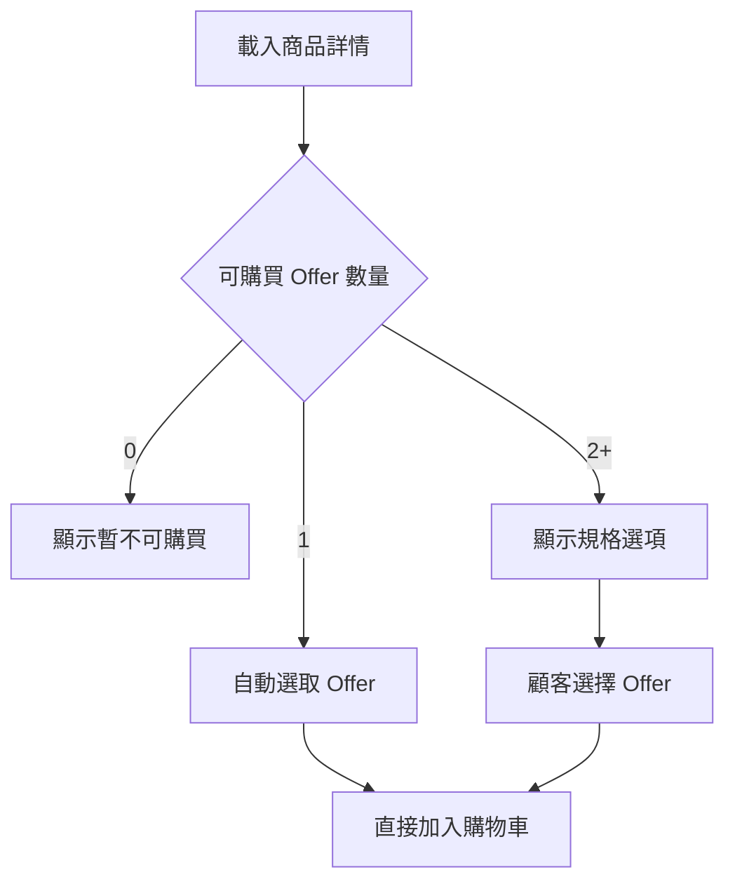
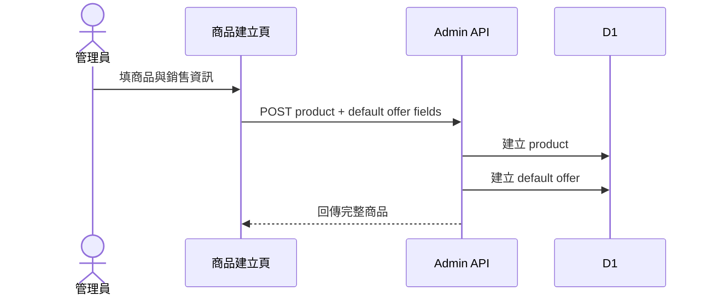

# Phase 1：商品規格選配設計

日期：2026-07-29

## 原始需求

實體商品與線上課程都可能只有單一售價，不應強迫管理員額外新增「規格」。只有當
顧客真的需要選擇尺寸、顏色、觀看期限或套組內容時，前台才應顯示規格。

## 需求理解

本階段只修正商品與 Offer 的使用方式，不提前加入課程、混合商品或條件式配送。

- 管理員建立商品時直接輸入售價、SKU 與庫存。
- 系統自動建立 default Offer，管理員不需要知道或維護它。
- 單一 Offer 的商品前台直接購買，不顯示「標準方案」。
- 新增第二種可選方案時才切換為多方案介面。
- 現有多規格商品不能受到影響。

## 後台資訊架構

### 單一方案模式

```text
基本資料
  商品名稱
  網址
  描述

銷售資訊
  售價
  SKU（選填）
  追蹤庫存
  庫存數量

  [增加規格選項]
```

「增加規格選項」不是建立商品的必填步驟。

### 多方案模式

```text
銷售方案
  S / NT$680 / SKU-A-S / 庫存 5
  M / NT$680 / SKU-A-M / 庫存 8
  L / NT$720 / SKU-A-L / 庫存 2

  [新增方案]
```

多方案模式顯示方案名稱；單一 default Offer 不顯示名稱輸入。

## 前台流程



規格顯示與否由公開 Offer 數量決定，不由商品類型決定。

## 資料設計

初期沿用 `product_variants`，加入 Offer 語意需要的欄位：

| 欄位 | 說明 |
| --- | --- |
| `is_default` | 系統自動方案 |
| `title` | default 可保存空字串或內部名稱，但公開 API 不顯示 |
| `price` | 唯一價格來源 |
| `sku` | 單一與多方案都可使用 |
| `stock` | phase1 暫時沿用；phase2 才移到 inventory |
| `enabled` | 是否可購買 |

每個商品最多一筆 default Offer。若商品有公開的多方案，default Offer 不得額外出現在
顧客選單。

## 建立商品流程



Product 與 default Offer 必須視為同一個建立操作。若第二步失敗，不能留下無法販售且
介面無法解釋的半成品；實作應使用 D1 batch 或明確補償。

## 從單一方案切換多方案

建議流程：

1. 管理員點「增加規格選項」。
2. 介面要求輸入第一組選項名稱與值。
3. 現有 default Offer 轉為第一筆公開 Offer，沿用原本 id、價格、SKU 與庫存。
4. 新增其他 Offer。
5. 儲存成功後前台才顯示選項。

沿用 id 可以避免目前購物車中的 default Offer 在切換瞬間全部失效。訂單已有標題與
價格快照，不會因 Offer 改名而改變歷史內容。

## 從多方案切回單一方案

這是破壞性較高的操作，不能只隱藏其他 Offer：

- 必須選擇哪一筆保留為 default。
- 其他 Offer 若在購物車中，下一次驗算會回報 unavailable。
- 已有訂單仍保留快照。
- 有未完成訂單保留庫存時，禁止直接刪除；先停用，等保留解除後再清理。

phase1 可以先不提供「切回單一方案」，只允許停用多餘方案，避免第一版引入不必要的
轉換風險。

## API 表現

管理端可以回傳：

```json
{
  "salesMode": "single",
  "defaultOffer": {
    "id": "offer-id",
    "price": 680,
    "sku": "BRUSH-01",
    "stock": 20
  },
  "offers": []
}
```

公開端仍回傳可購買 Offer，但增加：

```json
{
  "requiresOfferSelection": false,
  "offers": [
    {
      "id": "offer-id",
      "title": null,
      "price": 680,
      "inStock": true
    }
  ]
}
```

前端不得依 `title === "標準方案"` 判斷是否隱藏；使用明確旗標或 Offer 數量。

## 例外與錯誤狀態

| 情況 | 處理 |
| --- | --- |
| 商品沒有 enabled Offer | 不得上架；公開端顯示不可購買 |
| default Offer 重複 | API 回 409 |
| 價格變更時購物車已有舊資料 | Cart validate 回傳伺服器新價格 |
| 單一 Offer 缺貨 | 直接顯示售完，不顯示空的規格區 |
| 多 Offer 只有一筆仍有庫存 | 仍顯示所有公開選項與售完狀態 |
| 停用目前選中的 Offer | 下一次驗算回 unavailable |

## 本階段不做

- 不分離 inventory item。
- 不加入課程 component。
- 不改配送判斷。
- 不新增 entitlement。
- 不支援 bundle。
