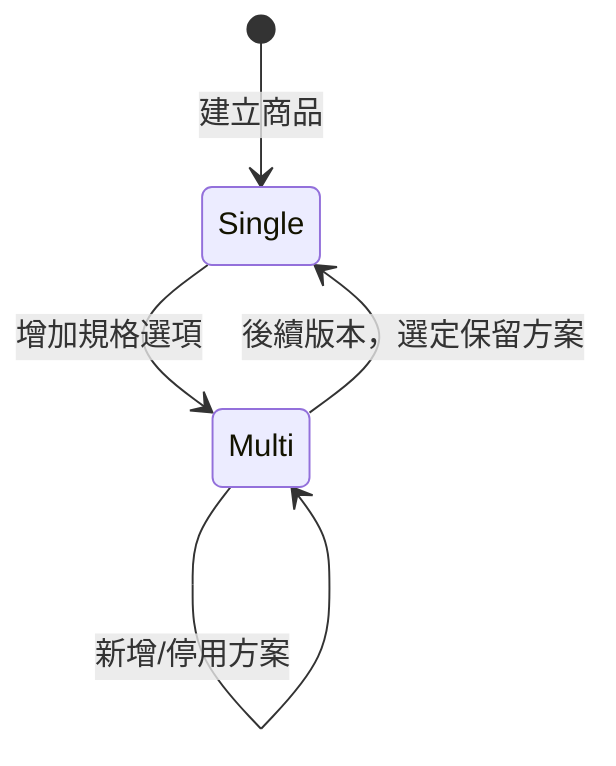

# Phase 1 規格：商品規格選配

## 目標

讓管理員在不手動建立規格的情況下完成單一商品建立與販售，同時保留現有
`variantId` 購物車及多規格商品的相容性。

## 後端規格

### Migration

- `product_variants` 增加 `is_default INTEGER NOT NULL DEFAULT 0`。
- 建立 partial unique index 或由 API 保證每商品最多一筆 default。
- 對只有一筆 variant 的既有商品標記為 default。
- 多筆 variant 的既有商品全部維持公開方案，不自動猜測哪筆是 default。
- 不搬移 `price`、`sku`、`stock`；phase2 才處理 inventory。

### 建立商品

管理端建立商品 request 增加：

```text
price: integer
sku: string
stock: integer
enabled: boolean
```

`trackStock` 尚無資料模型，不在 phase1 request 中接受；不得以巨大庫存數字模擬 unlimited。

API 建立 Product 後立即建立 default Offer。回應必須包含兩者。建立中任何一步失敗，
不得回傳成功。

### 更新單一商品

`PUT /api/products/{id}` 更新 Product 展示欄位；銷售欄位可以：

1. 同一 request 內提供並由 service 同時更新 default Offer；或
2. 使用明確的 `/offers/{id}` endpoint。

介面雖然顯示在同一頁，領域函式仍要分開驗證 Product 與 Offer。

### 公開商品

Public product response 必須提供：

- `requiresOfferSelection`
- 可購買 Offer 清單
- 單一 default Offer 的 title 回傳 `null` 或省略
- 不回傳 `is_default` 的內部實作細節也可以，但不得靠文案判斷

## 前端規格

### 管理端

- ProductCreatePage 預設呈現一組「銷售資訊」。
- ProductEditPage 單一模式編輯 default Offer。
- 只有多方案時才呈現方案列表。
- 「增加規格選項」需要清楚說明會把目前價格轉成第一個方案。
- 儲存失敗不得在本地假設 mode 已切換。

### 商城

- 一筆可購買 Offer：載入後自動選取。
- 兩筆以上：顯示選項並要求選擇。
- 零筆：購買按鈕停用。
- 單一 Offer 售完：顯示售完，不顯示規格容器。
- 加入購物車仍保存既有 `variantId`，phase1 不更改 localStorage shape。

## 驗證規則

| 欄位 | 規則 |
| --- | --- |
| price | 整數，沿用現有 PAYUNi 金額上下限 |
| sku | 選填，清除首尾空白，長度沿用現有規則 |
| stock | 整數且大於等於 0 |
| title | default Offer 不要求；公開 Offer 必填 |
| enabled | 商品上架前至少一筆為 true |

`trackStock` 在 phase1 可先只作介面預留，不得用巨大數字模擬 unlimited。若現有 schema
尚無法表達無限庫存，純課程商品在 phase2 前不得上架。

## 狀態轉移



phase1 必須完成 `Single -> Multi`；`Multi -> Single` 可以列為後續項目，但 API 不得
讓管理員透過刪除操作意外進入無 Offer 狀態。

## 測試範圍

### 後端

- 建立商品會自動建立一筆 default Offer。
- 建立失敗不留下孤兒 Product。
- 單一既有 variant backfill 正確。
- 多 variant 商品不被錯誤隱藏。
- default Offer 不要求 title。
- 上架無 enabled Offer 的商品被拒絕。
- Cart validate 仍接受既有 `variantId`。

### 前端

- 單一 Offer 不渲染規格列表。
- 單一 Offer 可以直接加入購物車。
- 多 Offer 必須選擇。
- 單一售完商品顯示售完。
- Product create 不要求規格名稱。
- 從單一模式開啟多方案時保留售價與庫存輸入。

## `variantId` 相容觀察期

`offerId` 是 API 名詞，值等於 `variantId`。舊名稱要保留多久不能用「一週」這種猜測。

### 保留範圍

| 介面 | 保留內容 |
| --- | --- |
| localStorage `luma-cart` | `[{variantId, quantity}]` 的讀取 |
| `POST /api/cart/validate` | request 的 `variantId` 欄位 |
| checkout lines | request 的 `variantId` 欄位 |
| `order_items.variant_id` | 欄位本身永久保留（訂單快照） |

phase1 不改任何一項；phase3 升級 shape 時新增 `offerId`，兩者同時可收，同傳但不同值回 400。

### 移除門檻

四項全部成立才能停止讀舊名稱：

1. 至少**兩個**已發布的前端版本都寫入新 shape。一個版本不夠：回滾到前一版就會再度寫入舊 key。
2. 舊 shape 的 production request 連續 **90 天**為零，且有 log 或指標可以證明。
3. 能讀新 shape 的後端版本已經是可回滾的版本之一。
4. phase7 的 backfill 對帳與備份／還原 runbook 已完成。

90 天不是通則，是這個 cart 的實際條件：`luma-cart` **沒有 TTL**
（`frontend/src/storefront/lib/cart.ts`），久未回訪的顧客瀏覽器可能還存著數月前的
舊格式購物車。縮短這個數字等於選擇讓那些人的購物車靜默清空。

`order_items.variant_id` 不適用上述門檻：它是歷史快照，永遠不移除。

## 驗收標準

- 新增單一實體商品不需要進入規格編輯器。
- 前台不出現「預設規格」或「標準方案」。
- 現有多規格商品的價格、庫存與購物車流程不變。
- 不新增 Product 層的第二份 price 或 stock。
- phase1 部署後可以安全回滾前端；資料仍是現有 variant 結構的超集。
