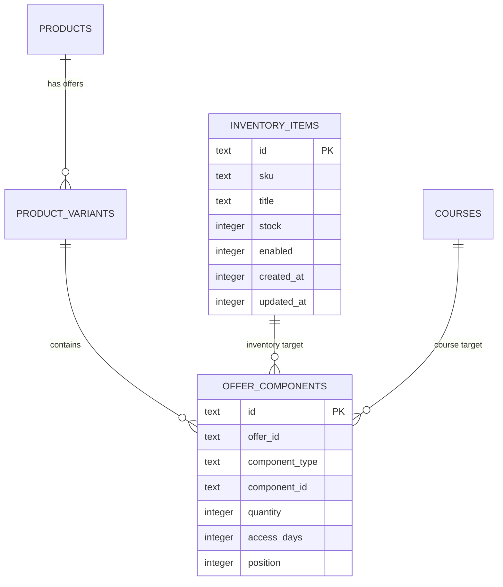
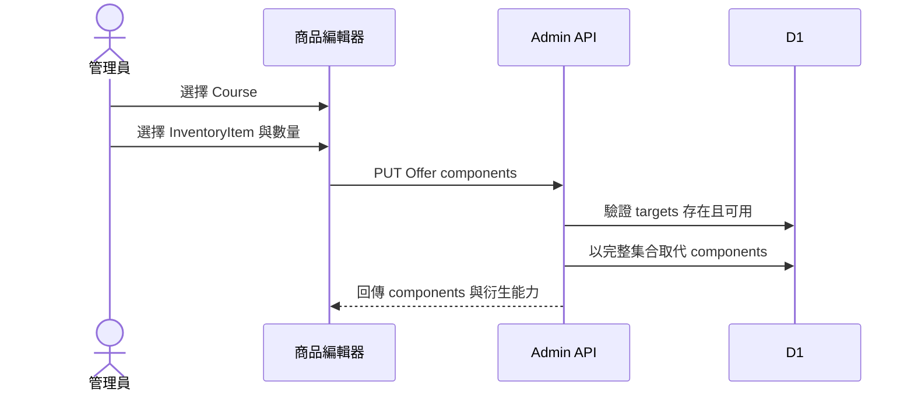

# Phase 2：可組合商品內容與庫存分離設計

日期：2026-07-29

## 原始需求

商城需要同時支援：

- 純實體商品。
- 純線上課程。
- 線上課程加實體材料包。
- 多門課程組合。
- 多個實體品組合。
- 材料包可以只作為組合內容，也可以另外單獨販售。

固定的「實體／數位／混合／組合」商品類型無法長期涵蓋這些排列。本階段將
「顧客買到的銷售方案」與「系統實際交付的內容」分離。

## 需求理解

Product 與 Offer 負責商業呈現及定價；InventoryItem 與 Course 才是實際履約目標。

```text
商品：水彩花卉完整套組
Offer：永久觀看＋材料包，NT$3,980
Components：
  Course「水彩花卉入門」× 1，永久
  InventoryItem「水彩材料包」× 1
```

商品是否為純數位、實體或混合，由 components 推導，不儲存可漂移的 `product_type`。

## 核心設計

### Offer 是販售單位

- 一個 Product 可以有 default Offer 或多個公開 Offer。
- Offer 保存售價、啟用狀態與顧客需要選擇的名稱。
- Offer 不直接保存真正庫存。

### InventoryItem 是庫存單位

- 保存 SKU、名稱與庫存。
- 可以被多個 Offer 引用。
- 可以沒有自己的商城頁。
- 所有引用同一 InventoryItem 的商品共享庫存。

### Course 是數位交付單位

phase2 只建立課程骨架，讓 Offer 可以引用；章節、影片與完整管理介面在 phase5。

- Course 有 draft/published/archived 狀態。
- draft 或 archived Course 不得加入新的 active Offer。
- 已售出後封存 Course 不會自動撤銷既有 entitlement。

### OfferComponent 是交付定義

| component type | target | quantity | 額外資料 |
| --- | --- | --- | --- |
| `inventory` | `inventory_items.id` | 大於 0 | 無 |
| `course` | `courses.id` | 固定 1 | `access_days`，NULL 為永久 |

## 資料關係



## 商品能力推導

```text
containsCourse =
  任一 component_type == course

requiresShipping =
  任一 component_type == inventory

digitalOnly =
  containsCourse && !requiresShipping

isBundle =
  component 數量 > 1
```

上述旗標只由後端 domain service 計算。管理前端不提交這些值，資料庫也不重複保存。

## 管理端設計

### 商品內容區塊

```text
商品內容

  線上課程
  水彩花卉入門
  觀看期限：永久
  [移除]

  實體商品
  水彩材料包 × 1
  目前庫存：12
  [移除]

  [+ 加入課程] [+ 加入實體品]

系統摘要：付款後立即開通課程，並需要安排寄送。
```

每個 Offer 各自維護內容。例如：

- 「線上版」只含 Course。
- 「材料版」含 Course 與 InventoryItem。

### 庫存品管理

需要一個簡單的 InventoryItem 管理介面：

- 名稱
- SKU
- 庫存數量
- 啟用狀態
- 被哪些 Offer 使用

刪除前列出引用；已被使用或出現在訂單履約快照時以封存取代刪除。

### 課程骨架

phase2 提供最低限度的 Course picker 資料：

- 建立 draft Course。
- 名稱與內部識別。
- 在 Offer component 中選取。

完整課程描述、章節與影片在 phase5。

## 建立混合 Offer 流程



使用完整集合更新，而不是讓前端逐筆新增／刪除，可避免儲存失敗時留下只含課程或
只含材料包的半套 Offer。

## 既有資料遷移

目前 `product_variants` 同時保存 SKU 與 stock。遷移分為三步：

1. 為每筆既有 variant 建立一筆 InventoryItem，保留原 SKU 與 stock。
2. 為 variant 建立一筆 quantity=1 的 inventory component。
3. 程式改讀 InventoryItem 後，停止直接更新 variant.stock。

過渡期間不得長期雙寫兩份 stock。切換應以部署邊界完成，並保留舊欄位一段時間供
回滾，但新版本只認一個來源。

## Bundle 限制

第一版不允許 component 指向另一個 Offer，只能直接指向 Course 或 InventoryItem。
因此天然沒有 bundle 遞迴或循環。

需要共用一組內容時，可以在管理端提供「複製其他方案內容」，但儲存後仍是平坦的
component 清單。

## 本階段不做

- 不修改購物車與結帳配送判斷。
- 不建立正式課程觀看權。
- 不允許課程商品公開上架。
- 不上傳影片。
- 不建立章節與單元。
