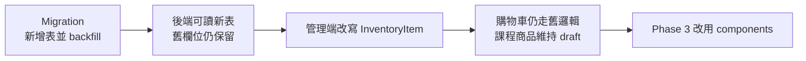

# Phase 2 規格：可組合 Offer 與 Inventory

## 目標

建立 Offer、Course 與 InventoryItem 的平坦組合模型，完成既有商品庫存 backfill，
並提供管理端編輯商品內容的能力。

## 資料庫規格

### `inventory_items`

```sql
CREATE TABLE inventory_items (
  id TEXT PRIMARY KEY NOT NULL,
  sku TEXT NOT NULL DEFAULT '',
  title TEXT NOT NULL,
  stock INTEGER NOT NULL DEFAULT 0,
  enabled INTEGER NOT NULL DEFAULT 1,
  created_at INTEGER NOT NULL,
  updated_at INTEGER NOT NULL
);
```

索引：

- 非空 SKU 的唯一性由 API 驗證或建立合適的 partial unique index。
- `(enabled, title)` 供 picker 使用。

### `courses`

phase2 最小欄位：

```sql
CREATE TABLE courses (
  id TEXT PRIMARY KEY NOT NULL,
  slug TEXT NOT NULL,
  title TEXT NOT NULL,
  status TEXT NOT NULL DEFAULT 'draft',
  created_at INTEGER NOT NULL,
  updated_at INTEGER NOT NULL
);
```

`slug` 唯一。phase5 以 additive migration 增加展示欄位。

### `offer_components`

```sql
CREATE TABLE offer_components (
  id TEXT PRIMARY KEY NOT NULL,
  offer_id TEXT NOT NULL,
  component_type TEXT NOT NULL,
  component_id TEXT NOT NULL,
  quantity INTEGER NOT NULL DEFAULT 1,
  access_days INTEGER,
  position INTEGER NOT NULL
);
```

索引與約束：

- unique `(offer_id, component_type, component_id)`
- index `(offer_id, position)`
- index `(component_type, component_id)`，用於引用查詢
- `component_type` 僅允許 `course`、`inventory`
- course quantity 必須為 1
- inventory quantity 必須介於 1 與既定上限
- inventory 的 `access_days` 必須為 NULL
- course 的 `access_days` 為 NULL 或正整數；NULL 為永久，正整數表示**首次觀看後**的天數，
  不是購買後的天數。倒數由 phase6 的首次播放授權啟動，phase2 只保存設定值。

## Domain API

### 解析 Offer

新增單一入口：

```text
resolve_offer(env, offer_id, purchase_quantity) -> ResolvedOffer
```

回傳：

```json
{
  "offerId": "id",
  "price": 3980,
  "quantity": 1,
  "containsCourse": true,
  "requiresShipping": true,
  "components": [
    {
      "type": "course",
      "courseId": "course-id",
      "accessDays": null
    },
    {
      "type": "inventory",
      "inventoryItemId": "kit-id",
      "quantity": 1,
      "requiredQuantity": 1
    }
  ]
}
```

`requiredQuantity = component.quantity × purchase_quantity`。phase3 的 Cart 與 Order
必須共用此函式，避免顯示可買但結帳時使用另一套展開規則。

### 更新 Components

管理 API：

```text
PUT /api/offers/{offerId}/components
```

request：

```json
{
  "components": [
    {"type": "course", "componentId": "course-id", "quantity": 1, "accessDays": null},
    {"type": "inventory", "componentId": "kit-id", "quantity": 1}
  ]
}
```

API 先驗證完整集合，再一次寫入。不能接受前端提交 `requiresShipping` 等衍生欄位。

### Inventory API

```text
GET    /api/inventory-items?q=&enabled=
POST   /api/inventory-items
GET    /api/inventory-items/{id}
PUT    /api/inventory-items/{id}
POST   /api/inventory-items/{id}/archive
GET    /api/inventory-items/{id}/references
```

庫存調整需要 audit detail，不能用一般商品編輯 request 靜默覆蓋。

### Course Skeleton API

```text
GET  /api/courses?status=
POST /api/courses
GET  /api/courses/{id}
PUT  /api/courses/{id}
```

phase2 只允許基本名稱、slug 與狀態；公開 Course API 尚不開放。

## Backfill 規格

每筆既有 `product_variants`：

1. 使用可重現或保存對照的 inventory id。
2. `inventory_items.sku = variant.sku`。
3. `inventory_items.title = product.title + variant.title`，default Offer 避免重複文案。
4. `inventory_items.stock = variant.stock`。
5. 建立一筆 quantity=1 的 inventory component。

Backfill 必須可重跑：

- 使用 `INSERT OR IGNORE` 或固定 id。
- 不重複 component。
- 不覆寫部署後管理員已調整的 inventory stock。

## 切換策略



phase2 結束時，庫存管理的唯一寫入來源應為 InventoryItem；現有商城仍可以透過
compatibility adapter 取得舊商品所需庫存。

## 管理端規格

- Offer 編輯增加「商品內容」Panel。
- Course picker 只列出 draft/published 且未 archived 的課程。
- Inventory picker 顯示 SKU、名稱、可用庫存與引用數。
- Components 可排序，但排序不影響庫存或授權語意。
- 顯示後端回傳的能力摘要。
- 同一 target 不可重複加入；需要多份時修改 quantity。

## 測試範圍

- 既有 variant backfill 數量、SKU、stock、component 正確。
- Backfill 重跑不重複也不覆寫新值。
- Course 與 Inventory component 驗證。
- 重複 component、錯誤 type、錯誤 target、負 quantity 被拒絕。
- 衍生旗標涵蓋純實體、純課程、混合與空內容。
- 被引用 InventoryItem/Course 不可硬刪除。
- default Offer 與多 Offer 都能保存自己的 components。

## 驗收標準

- 同一材料包可被兩個 Offer 引用且共用庫存。
- Offer 可以同時包含 Course 與 InventoryItem。
- 不存在 `hybrid` 或 `bundle` 商品類型欄位。
- 管理員可看懂一個 Offer 實際會授予和寄送什麼。
- phase2 不改變目前公開商城的結帳行為。
