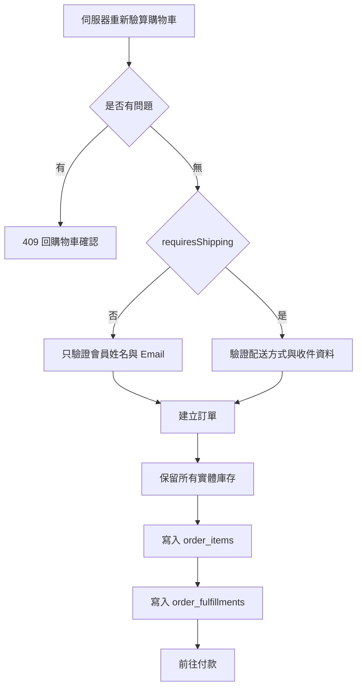
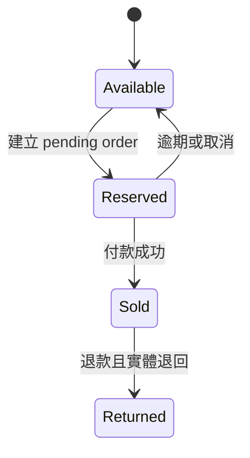
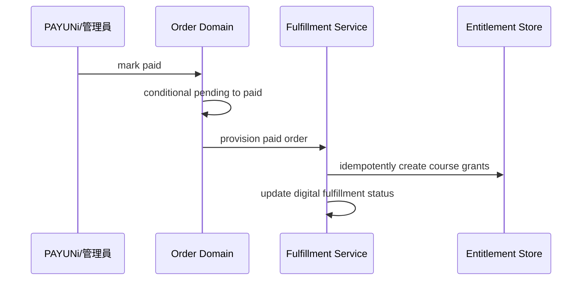

# Phase 3：混合購物車、條件式結帳與履約設計

日期：2026-07-29

## 原始需求

商城必須能正確販售純課程、純實體與課程加材料包：

- 純課程不要求填地址或選物流。
- 只要訂單內有實體品，就需要收件資料與配送方式。
- 實體品扣庫存，課程不使用假庫存。
- 付款成功後才授予課程。
- 混合商品付款後可以立即觀看課程，實體部分繼續等待出貨。
- 付款通知重送、付款逾期與取消不能造成重複授權或錯誤庫存。

## 現況問題

目前購物車逐筆讀取 `product_variants.stock`，所有商品都必須有正數庫存。結帳也固定
要求 `shippingMethod`。訂單只保存 variant 快照，沒有保存展開後要交付的課程或
實體內容。

因此本階段不是在既有流程加幾個 if，而是讓 Cart 與 Order 共用 phase2 的
`resolve_offer`，把交易與履約內容拆開。

## CartQuote 設計

CartQuote 必須同時回傳顧客畫面與結帳所需的伺服器判斷：

```json
{
  "lines": [],
  "problems": [],
  "subtotal": 4980,
  "shippingSubtotal": 3980,
  "requiresShipping": true,
  "containsCourse": true,
  "shipping": []
}
```

### 金額規則

- `subtotal`：所有 Offer 的售價乘數量。
- `shippingSubtotal`：只加總含任何 inventory component 的 Offer line。
- 純課程 Offer 不計入免運門檻。
- 混合 Offer 無法再拆售價，因此整筆 line 計入 shippingSubtotal。
- 運費不由前端計算。

### 數量規則

- 純課程與包含課程的混合 Offer，購買數量固定為 1。
- 會員已對某個 course component 持有有效 entitlement 時，不得再次結帳該 Offer；同 Offer
  也只能有一筆未過期的 pending 訂單。到期或所有來源撤銷後才能重買。
- 純實體 Offer 可以依現有購物車規則購買多件。
- Inventory component 的需求量為 component quantity × cart quantity。
- 同一 InventoryItem 被多個 line 引用時，必須先彙總後再檢查庫存。
- 同一 Course 被多個 line 包含時，付款後只授予一次，但訂單快照保留每個來源。

## 結帳流程



前端送來的 `requiresShipping`、subtotal、運費及 component 清單全部不可信。API 每次
都由 Offer id 重新解析。

## 訂單快照

### `order_items`

保留顧客看到的交易內容：

- Product 與 Offer id。
- 商品與方案名稱。
- 單價、數量、小計。
- 是否含課程、是否需要配送的當下結果。

### `order_fulfillments`

保存每個 component 的當下內容：

| 類型 | 快照 |
| --- | --- |
| course | course id、課程名稱、access days、來源 order item |
| inventory | inventory item id、SKU、名稱、所需數量、出貨狀態 |

後續改動 Offer components 不得重寫這些資料。

## 庫存保留

延續現有「建立訂單時保留、逾時回補」原則，但扣減目標改為 InventoryItem。



D1 沒有互動式長交易，實作使用帶條件的原子 UPDATE：

```sql
UPDATE inventory_items
SET stock = stock - ?quantity
WHERE id = ?id AND enabled = 1 AND stock >= ?quantity;
```

多項內容中途失敗時，必須按已扣清單逐筆補償，與目前 order reserve 的防超賣策略一致。

## 付款與課程授權



授權必須可重試。若訂單已標記 paid 但授權步驟失敗，背景 reconciliation 必須找出
`paid + digital fulfillment pending` 並補做，不能只依賴一次付款 callback。

### 期限不在付款時起算

provision 只把 fulfillment 快照的 `access_days` 寫入 entitlement，`expires_at` 保持 NULL。
期限型授權要到 phase6 第一次成功取得受保護播放權時，才以條件更新寫入
`first_viewed_at` 與 `expires_at = first_viewed_at + access_days`。因此付款 callback 重送、
reconciliation 重跑或會員反覆播放都不會改變到期日。永久授權 `access_days` 為 NULL，
兩個時間欄位一直是 NULL。

### 重複購買保護

含 Course 的 Offer 在 cart 與 checkout 都要檢查會員是否已擁有。權威判斷發生在建立訂單時：
先以 unique `(customer_id, offer_id)` 取得 `course_offer_purchase_locks` 的 pending lock，
再查各 component Course 的 active entitlement。lock 讓兩個併發 checkout 只有一個成功，
避免付款後才發現無法授權。pending 取消或逾期釋放 lock；paid 後 lock 保留到 entitlement
到期或所有相關 source 被撤銷。

## 配送與地址

| Cart 組成 | 配送 UI | 訂單欄位 |
| --- | --- | --- |
| 全部純課程 | 不顯示 | `shipping_method = none`，地址空 |
| 任一實體 | 顯示 | 使用現有宅配或超商流程 |
| 混合 Offer | 顯示 | 同一訂單同時有 digital 與 physical fulfillment |

會員 profile 中既有地址仍可保存，但純課程結帳不強迫填寫，也不應用空字串覆蓋既有
預設地址。

## 訂單後台

訂單詳情分為：

```text
購買項目
  水彩完整套組 × 1  NT$3,980

數位內容
  水彩花卉入門  已開通

待出貨內容
  水彩材料包 × 1  待出貨
```

只有存在 physical fulfillment 的訂單才能進入 shipped。純數位訂單在所有 digital
fulfillment 與 entitlement provision 成功後**自動轉 completed**；任何 provision 失敗都
保持 paid 等待重試。混合訂單不套用此轉移：課程在 paid 後立即開通，實體部分仍走
`shipped -> completed`。

## 錯誤與補償

| 失敗點 | 處理 |
| --- | --- |
| 一項庫存不足 | 回補先前已保留項目，釋放已取得的 purchase lock，訂單不建立成功 |
| 已擁有該 Course | cart 回 `already_owned`，checkout 回 409，不建立訂單 |
| 取不到 purchase lock | 回 `purchase_in_progress`／409，指向既有 pending 訂單 |
| 寫 order_items 失敗 | 回補所有保留庫存並釋放 lock |
| 寫 fulfillment 失敗 | 不得留下可付款的半成品訂單 |
| 付款成功後授權失敗 | 訂單維持 paid，標記 pending 並重試；不轉 completed |
| 重複付款通知 | mark_paid 不重複轉移；provision 可安全重跑 |
| pending 逾期 | 回補 physical fulfillment 並釋放 purchase lock |
| entitlement 已存在 | 視為成功，不延長期限，也不重設 `first_viewed_at` |
| 全額退款／已付款取消／chargeback | 撤銷該訂單的 course sources；無其他有效 source 才撤銷 entitlement 並釋放 lock |
| 只退實體 component | 不動任何 course source |

## 退款與撤銷的邊界

撤銷收回的是**觀看權**：Course、Lesson 的會員存取與 private VideoAsset 的播放授權都會被
拒絕。不刪除 Course、Lesson、影片、觀看進度、訂單或 audit，讓後續恢復與稽核仍然可行。
部分退款必須由呼叫端點名受影響的 course fulfillment，系統不從訂單金額推測。

phase3 只提供撤銷與補發的 domain API 與 audit；管理 UI、restore 與 chargeback 流程在 phase7。

## 本階段不做

- 不提供影片上傳或播放。
- 不啟動觀看期限倒數；`first_viewed_at` 由 phase6 播放授權寫入。
- 不公開完整課程頁。
- 不支援多人席次；贈送只保留 `gift` source 的 domain 介面，UI 在 phase7。
- 不做部分出貨、多包裹或拆單。
- 不做自動退款；只定義授權撤銷與庫存的後續接口。
