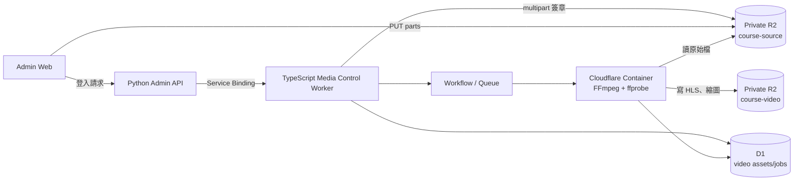
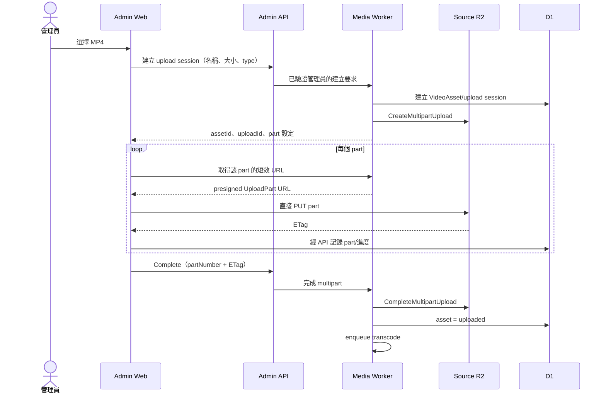
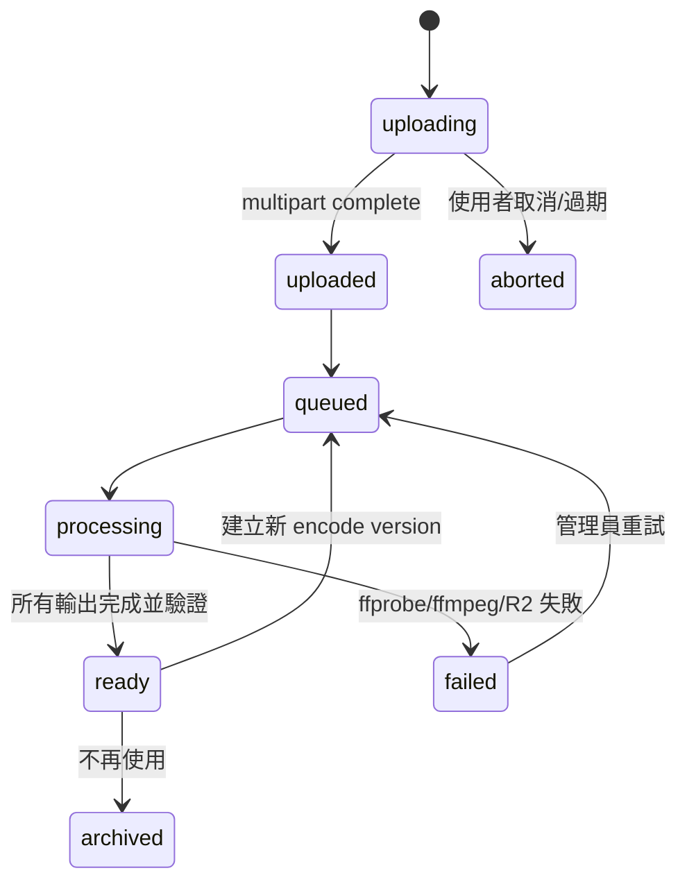

# Phase 4：課程影片上傳與轉檔管線設計

日期：2026-07-29

> **2026-07-30 決策：不使用 Cloudflare Container。**
>
> 本文件其餘部分描述的自建轉檔管線（Media Control Worker + Queue + FFmpeg
> Container）**沒有實作**。owner 決定不承擔 Container 的持續費用與運維面積。
>
> 實際採用的做法：**在本機轉檔，同步到 R2，再由一支端點驗證後註冊。**
>
> | 原設計 | 實際 |
> | --- | --- |
> | Container 跑 FFmpeg | `scripts/transcode-course-video.ps1` 在本機跑 |
> | Queue 排程與重試 | 不需要；轉檔失敗就在本機重跑 |
> | 瀏覽器 multipart 直傳 source | rclone 同步輸出到 `luma-course-video` |
> | Container 驗證 playlist 引用 | `POST /api/video-assets/import` 驗證後才標 ready |
> | Media Control Worker（TypeScript） | 不需要；沒有 SigV4 簽章的需求 |
>
> **驗證這件事變得更重要，不是更不重要。** 手動同步幾百個檔案，少傳一個是
> 常態，而少一個分段的影片會播到那一段才斷。所以 `video.verify_encode` 會讀
> master playlist、逐一確認每個被引用的物件都存在，並一次回報所有缺漏 ——
> 讓管理員重跑一次同步，而不是重跑六次。
>
> 資料表、物件路徑、狀態機、畫質階梯與播放閘道都照原設計實作，沒有改動。
> 如果日後要自動化轉檔，那些都還在，只需要補上排程與執行環境。

## 原始需求

- 管理員能在 Luma Studio Web 上傳課程影片。
- 大型影片不經過現有 Python Worker 的 request body。
- 原始 MP4 存入 private R2。
- 使用 Cloudflare 服務完成多畫質轉檔與 HLS 分片。
- 儲存與播放流量成本要低，不採用按觀看分鐘計費的 Cloudflare Stream。
- 上傳需要進度、失敗重試及續傳。
- 影片上傳後進入影片庫，再由課程單元選取。

## 需求理解

影片管線拆成三個責任：

1. **上傳控制**：驗證管理員、建立 multipart session、核發短效 part URL。
2. **轉檔工作**：可靠排程、重試與 Container FFmpeg 執行。
3. **影片資產**：保存來源、輸出版本、技術資訊與狀態，供課程引用。

瀏覽器直接上傳 R2，但不是取得 R2 長效金鑰。Luma Studio 只核發限定 bucket、object
key、operation 與短期限的上傳權限。

Cloudflare R2 建議大型影片使用 multipart，因為可以平行傳輸並只重傳失敗的 part：
[R2 Upload objects](https://developers.cloudflare.com/r2/objects/upload-objects/)。
瀏覽器直傳必須為管理後台網域設定限定 CORS：
[R2 CORS](https://developers.cloudflare.com/r2/buckets/cors/)。

## 部署架構



### 為什麼另外使用 TypeScript Media Worker

現有後端是 Python Worker，適合商城與管理 API，但媒體管線需要：

- AWS SigV4 multipart presign。
- Workflow／Queue／Container 整合。
- 與 FFmpeg Container 的 RPC 或 HTTP 控制。

建立小型 Media Control Worker 可以把 R2 API credentials 和 Container binding 限制在
單一服務。管理員身分仍由既有 Admin API 驗證，Media Worker 不直接公開管理登入。

若實作驗證證明 Python Worker 可以乾淨地完成同一件事，可以保留同部署；安全邊界與
API 契約不變。

## R2 分層

| Bucket | 公開性 | 內容 | 建議保存 |
| --- | --- | --- | --- |
| `luma-course-source` | private | 原始 MP4 | 至少保留到轉檔驗收；之後依政策刪除或封存 |
| `luma-course-video` | private | HLS、縮圖、字幕 | 課程使用期間 |
| `luma-ibon-images` | 維持現況 | 圖片與 ibon | 不放課程影片 |

Object key 不使用原始檔名：

```text
sources/{asset_id}/{upload_version}/source.mp4
videos/{asset_id}/{encode_version}/master.m3u8
videos/{asset_id}/{encode_version}/1080p/playlist.m3u8
videos/{asset_id}/{encode_version}/1080p/init.mp4
videos/{asset_id}/{encode_version}/1080p/segment-000001.m4s
videos/{asset_id}/{encode_version}/poster.webp
```

版本化 key 讓重新轉檔可以和目前可播放版本並存。只有新版本完整後才切換
`video_assets.active_encode_version`。

## 上傳流程



上傳 session 與 part 清單要保存於瀏覽器持久儲存和 D1，頁面重新整理後可以繼續。
R2 預設會清理未完成 multipart，但系統仍要提供主動 abort 與定期清理。

## 轉檔流程



Container 工作：

1. 從 private R2 讀取原始檔。
2. 使用 ffprobe 驗證真實容器、編碼、長度、尺寸與音軌。
3. 根據來源尺寸選擇不放大的 rendition。
4. 產生 H.264/AAC、fMP4 HLS，預設 6 秒 segment。
5. 產生 poster 與必要的預覽資料。
6. 每完成一批輸出就寫回 R2，避免 ephemeral disk 同時保留所有 rendition。
7. 驗證 playlist 引用的 object 全部存在。
8. 最後才上傳 master.m3u8。
9. 以條件更新切換 active encode version。

建議 rendition：

| 名稱 | 最大解析度 | 使用條件 |
| --- | --- | --- |
| 1080p | 1920×1080 | 來源高度至少 1080 |
| 720p | 1280×720 | 來源高度至少 720 |
| 480p | 854×480 | 一般來源 |

實際 bitrate、keyframe 與 audio 設定需要用代表性畫畫教學素材驗證；細線、紙張紋理
比一般 talking-head 更容易在低 bitrate 出現塊狀失真。

## 資料表

### `video_assets`

| 欄位 | 說明 |
| --- | --- |
| `id` | 穩定資產 id |
| `title` | 後台搜尋名稱 |
| `original_filename` | 顯示用途 |
| `source_key` | private R2 key |
| `status` | 上傳與轉檔狀態 |
| `byte_size` | 來源大小 |
| `duration_seconds` | ffprobe 結果 |
| `width` / `height` | 來源尺寸 |
| `active_encode_version` | 目前發布輸出 |
| `master_key` | active master playlist |
| `poster_key` | 縮圖 |
| `error_code` / `error_detail` | 管理診斷 |
| `created_at` / `updated_at` | 時間 |

### `video_upload_sessions`

保存 asset、R2 upload id、part size、狀態、過期時間與完成時間。R2 secret 不入 D1。

### `video_transcode_jobs`

保存 asset、encode version、attempt、狀態、開始/完成時間、Container job id 與錯誤。

## 安全設計

- Source 與 Video bucket 都不開 public access。
- Presigned URL 視為 bearer token，期限盡量短。
- object key 由伺服器產生，不能由檔名或前端指定任意 prefix。
- CORS 只允許正式管理後台與明確的本機開發 origin。
- MIME 與副檔名只做早期提示，ffprobe 才是格式判斷。
- 限制單檔大小、影片長度、同時上傳數與同時轉檔數。
- 完成 multipart 前驗證 upload session 所屬管理員與狀態。
- Container 不持有管理員 session；只取得讀來源與寫特定輸出的最低權限。
- 錯誤訊息不回傳 R2 credentials、完整 presigned URL 或內部 Container secret。

## 成本控制

- 原始檔只轉一次，播放時不做即時轉碼。
- 只產生不超過來源尺寸的 rendition。
- master playlist 最後發布，失敗版本不會被播放器選到。
- 課程未引用且超過保留期限的 asset 可清理。
- 重新轉檔成功並完成切換後，舊版本延遲清理，保留短期 rollback。
- R2 Standard 適合經常播放的 HLS；不要為了低儲存單價把熱門 segment 放入有讀取費的
  Infrequent Access。

## 本階段不做

- 不將 VideoAsset 加入 CourseLesson；phase5 處理。
- 不做會員播放 gateway；phase6 處理。
- 不承諾 DRM。
- 不提供本機桌面上傳程式。
- 不直接從 R2 列出所有 object 當影片庫。
