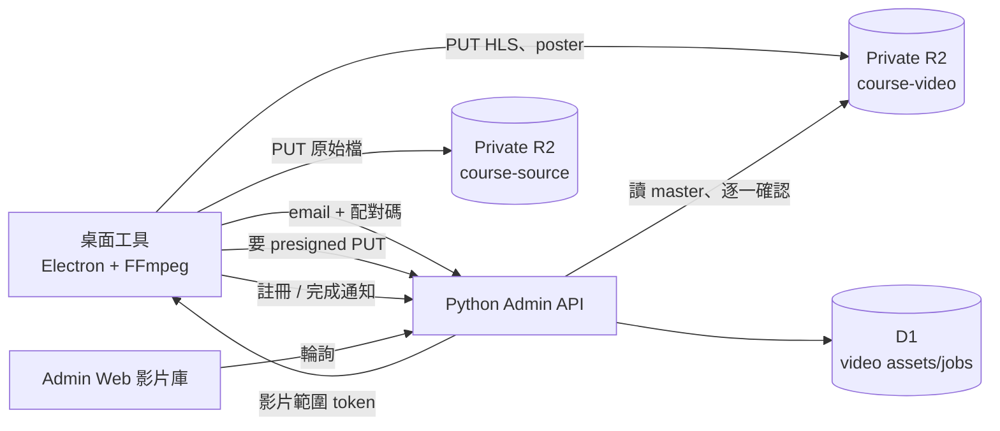
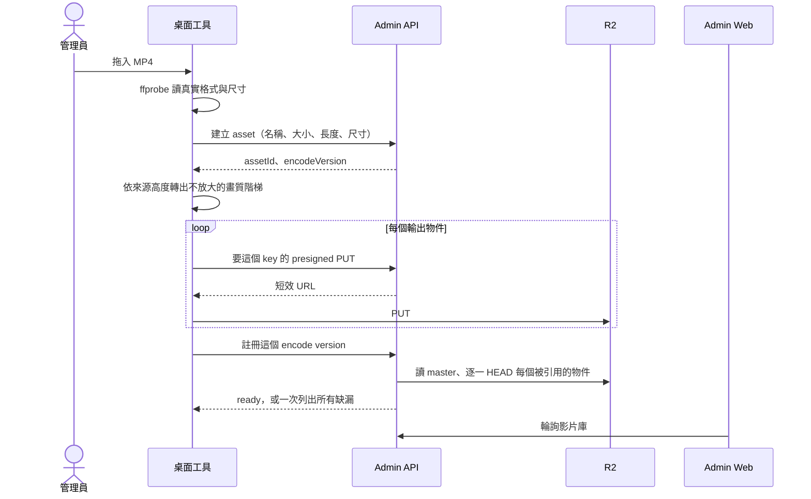
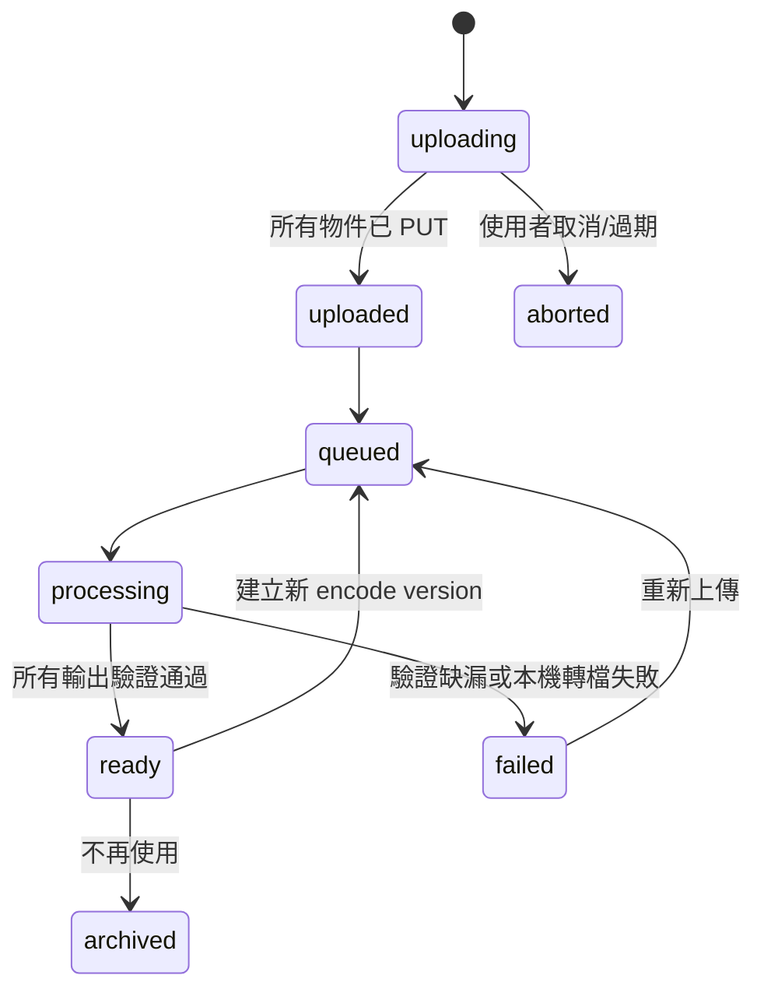

# Phase 4：課程影片上傳與轉檔管線設計

日期：2026-07-30

## 原始需求

- 管理員能把課程影片交給系統，不用手動記一堆指令。
- 大型影片不經過 Python Worker 的 request body。
- 原始 MP4 存入 private R2。
- 多畫質轉檔與 HLS 分片。
- 儲存與播放成本要低，不採用按觀看分鐘計費的 Cloudflare Stream。
- 上傳需要進度、失敗重試及續傳。
- 影片進入影片庫後，由課程單元選取。

## 轉檔跑在哪裡

Cloudflare 平台上沒有便宜的選項：

- **Stream** 按觀看分鐘計費。課程影片是長片、重複觀看，這條線的成本會跟著流量長。
- **Container + Queue** 可以跑 FFmpeg，但要付常駐費用，還要維護映像、lease、dead-letter、OOM 分類 —— 為了一週可能只跑幾支影片的工作。
- **Worker** 不能跑 FFmpeg，Python 或 TypeScript 都不行。

所以轉檔跑在管理員自己的機器上。素材本來就在那裡，CPU 已經付過錢了，而課程影片的量級（一支影片轉一次，一輩子）不值得為它養一個常駐執行環境。

這個決定唯一的代價是：轉檔的時候那台機器要開著。以目前的出片頻率，這不是代價。

## 為什麼是桌面工具

「在本機轉檔」不等於「叫管理員自己跑腳本」。一支 PowerShell 腳本要求對方安裝 FFmpeg、裝 rclone、設好 R2 profile、記住 asset id、最後手動送一個 JSON 去註冊。每一步都能做對，但每一步也都能做錯，而做錯的結果是一支播到一半會斷的影片。

所以 ingest 是一個獨立的桌面程式（`desktop/`，Electron）：拖進一個高畫質 MP4，它負責檢查環境、轉檔、上傳、註冊、通知，中間不需要人記得任何事。

它不是「管理後台的另一個版本」。它只做搬影片進來這件事：

| 桌面工具 | 管理後台 |
| --- | --- |
| 轉檔、上傳、註冊新影片 | 影片庫瀏覽、改名、封存、刪除 |
| 瀏覽 R2、新增資料夾與檔案 | 修改與刪除既有物件 |
| 取得 presigned URL 上傳 | 核發 presigned URL、驗證結果 |

修改與刪除留在後台，因為刪一支影片之前要先確認沒有課程單元在用它 —— 那個檢查在後端，桌面工具沒有理由重做一份。

## 信任邊界

**R2 的 S3 金鑰不進入桌面工具。** 這是整個設計最硬的一條線。工具會裝在管理員的筆電上，安裝檔會放在網路上，任何寫進去的長效金鑰等於公開的長效金鑰。

工具拿到的是一個**只能做影片相關操作的短效 token**，不是管理員 session：

- 不能改商品、訂單、會員、授權。
- 不能核發別人的 token。
- 每一次 S3 操作都是向 Admin API 要一張限定 bucket、key、method、期限的 presigned URL。簽章在後端做，工具只是拿著 URL PUT。

換句話說，工具能做的事等於 Admin API 願意替它簽的事。這讓「工具被拿走」的最壞情況是「有人可以上傳影片」，而不是「有人可以改訂單」。

## 驗證身分

管理員身分目前存在 `admin_sessions`（email + 允許清單），沒有密碼表可以讓桌面工具去驗。桌面工具也不該內嵌一個瀏覽器登入流程 —— 那等於把管理員 session 搬進桌面。

改用配對碼：

1. 工具啟動，要求輸入管理員 email 與 6 位數字。
2. 管理員在後台一個頁面上讀那組數字。該頁面只有已登入的管理員看得到。
3. 工具把 email + 數字送去 Admin API，換到影片範圍的 token。

數字是 TOTP，每個管理員一組 seed，30 秒一換。這樣「能看到後台」就是「能授權一台機器」，不需要新的密碼、也不需要在桌面上保存可以登入後台的東西。

Seed 存在 D1（新表，一個管理員一列），只在建立時顯示過一次。

## 部署架構



影片的 bytes 從工具直接進 R2，沒有一個 byte 經過 Worker 的 request body。Worker 只負責簽章、驗證與記帳。

### Presign 在 Python Worker 裡

SigV4 需要 HMAC-SHA256，標準庫的 `hmac` 與 `hashlib` 在這個 runtime 可以用 —— 播放 token 已經在用它們了。所以不需要為了簽章另外開一個 TypeScript Worker；R2 credentials 以 secret 存在 Admin Worker，只有 Admin Worker 看得到。

## R2 分層

| Bucket | 公開性 | 內容 | 保存 |
| --- | --- | --- | --- |
| `luma-course-source` | private | 原始 MP4 | 至少保留到轉檔驗收；之後依政策刪除或封存 |
| `luma-course-video` | private | HLS、縮圖、字幕 | 課程使用期間 |
| `luma-ibon-images` | 維持現況 | 圖片與 ibon | 不放課程影片 |

原始檔也上傳，因為重新轉檔需要它，而 HLS 階梯沒辦法從 HLS 階梯重建。若日後決定刪除原始檔以省儲存，那就等於接受「輸出不可重建」，必須先寫進保存政策，不能默默發生。

Object key 不使用原始檔名：

```text
sources/{asset_id}/{upload_version}/source.mp4
videos/{asset_id}/{encode_version}/master.m3u8
videos/{asset_id}/{encode_version}/1080p/playlist.m3u8
videos/{asset_id}/{encode_version}/1080p/init.mp4
videos/{asset_id}/{encode_version}/1080p/segment-000001.m4s
videos/{asset_id}/{encode_version}/poster.webp
```

版本化 key 讓重新轉檔可以和目前可播放版本並存。只有新版本完整後才切換 `video_assets.active_encode_version`。

## Ingest 流程



進度、已完成的 key 與 asset id 保存在工具本機，所以關掉重開可以接著傳，不用重新轉檔。

### 為什麼註冊要重新驗證一次

一支影片會產生幾百個物件。上傳中斷、某一個 PUT 靜靜失敗、或使用者以為傳完了其實還差三個，都是日常。而少一個分段的影片會**播到那一段才斷** —— 最糟的發現時機是會員正在看。

所以 `ready` 不是工具說的，是後端算的：讀 master playlist、跟著每個 rendition playlist 走一遍、HEAD 每一個被引用的物件，然後**一次回報所有缺漏**。一次列全部而不是列第一個，是因為要讓人重跑一次上傳，而不是重跑六次。

## 狀態機



轉移一律用條件 UPDATE。註冊端點是唯一能寫 `ready` 的地方，而且只在驗證通過後寫。

## 轉檔規格

工具跑的與 `video.ladder_for` 是同一套規則：

| 名稱 | 最大解析度 | 使用條件 |
| --- | --- | --- |
| 1080p | 1920×1080 | 來源高度至少 1080 |
| 720p | 1280×720 | 來源高度至少 720 |
| 480p | 854×480 | 一般來源 |

- 畫質階梯由 ffprobe 讀到的實際高度決定，不看副檔名也不看任何人的假設。
- 不放大來源。放大只是用更多頻寬和儲存送出一個更模糊的檔案。
- H.264 / AAC，fMP4 HLS，預設 6 秒 segment。
- keyframe 固定對齊 segment 邊界。播放器只能在 keyframe 換畫質，沒對齊的分段會讓切換卡住或失敗。
- poster 用 WebP，另存寬高。
- master playlist 手寫，不用 ffmpeg 的 `var_stream_map`：相對路徑是播放閘道換算 object key 的依據，手寫才能保證固定只有一層資料夾。
- 所有檔案的 Content-Type 要正確。以 octet-stream 送出的 playlist 沒有播放器讀得懂。
- 指令不拼接原始檔名、不經過 shell interpolation。所有路徑由 asset id 與 encode version 產生。

實際 bitrate 需要用代表性的畫畫教學素材驗證：細線與紙張紋理比一般 talking-head 更容易在低 bitrate 出現塊狀失真。

## 環境依賴

工具需要 FFmpeg 與 ffprobe。不打包進安裝檔，第一次啟動時下載，**只從我們自己的 R2 鏡像**：

- 版本釘死，連同 SHA256 一起記在工具裡，對不上就不執行。
- 官方發布頁的檔名與連結會改，舊版本會下架。鏡像不會。
- 「官方失敗就退回鏡像」聽起來更省，實際上是把最少被測到的那條路留到官方真的壞掉的那天才第一次執行；而且「官方失敗」很難判斷 —— 404、很慢、檔名換了、傳一半、回一頁 HTML 錯誤頁，長得都不一樣。
- R2 沒有 egress 費用，這是它跟 S3 最主要的差別。一台機器抓一次一百多 MB，成本落在 Class B 操作與儲存，一年個位數次下載的量級，錢不是考量。

FFmpeg 是 GPL。放在自己的鏡像上就是散布，所以 LICENSE 與對應的原始碼壓縮檔一起鏡像，路徑寫在工具的「關於」畫面裡。這個義務跟從哪裡下載無關 —— 只要我們有託管，它就成立。

## 安裝與更新

參照 `C:\Code\FotoBuddy` 的作法：

- electron-vite 建置，electron-builder 打 NSIS 安裝檔。
- **不簽章。** 代價要說清楚：Windows SmartScreen 會對下載與安裝提出警告，管理員要手動放行。使用者只有管理員本人，所以可以接受，但不能假裝不存在。
- CI 打包後上傳到 R2。
- 更新用 electron-updater 的 generic provider，指向 Admin API 的 `/releases/{version}/{file}` —— 該路由從 R2 串出檔案，version 與檔名都走白名單，不讓任意路徑穿過去。
- 版本政策放在 D1 一列（latest、minSupported、forceUpdate、blocked、feedUrl），後台一頁可讀可改，也放安裝檔的下載連結。
- 桌面圖示用苒光繪誌 logo 的星芒，跟 web favicon 同一個圖形。各尺寸都要出，不然工作列上只會是一顆鼻屎。

## 完成後怎麼讓後台知道

工具註冊成功後通知 Admin API，影片庫要看得到新影片。後台用**輪詢**，三秒一次：

- 影片庫是一個管理員偶爾打開的頁面，不是即時協作介面。
- SSE 或 WebSocket 要在 Worker 上維持連線，為了這個場景不值得。
- 三秒的延遲對「等轉檔完成」這件事沒有差別，而輪詢壞掉的方式是「慢一點」，連線壞掉的方式是「靜靜地不再更新」。

只在影片庫頁面開著的時候輪詢，離開就停。

## 安全設計

- Source 與 Video bucket 都不開 public access。
- Presigned URL 視為 bearer token，期限盡量短，不進 log。
- object key 由伺服器產生，前端與工具都不能指定任意 prefix。
- 桌面工具的 token 只能做影片操作，且可撤銷。
- CORS 只允許正式管理後台與明確的本機開發 origin，不用 `*`。
- MIME 與副檔名只做早期提示，ffprobe 才是格式判斷。
- 限制單檔大小、影片長度、同時上傳數。
- 錯誤訊息不回傳 R2 credentials、完整 presigned URL 或 token。
- 配對碼比對用固定時間比較，並限制嘗試次數 —— 六位數字擋不住無限次猜測。

## 成本控制

- 原始檔只轉一次，播放時不做即時轉碼。
- 只產生不超過來源尺寸的 rendition。
- master playlist 最後發布，失敗版本不會被播放器選到。
- 課程未引用且超過保留期限的 asset 可清理。
- 重新轉檔成功並切換後，舊版本延遲清理，保留短期 rollback。
- R2 Standard 適合經常播放的 HLS；不要為了低儲存單價把熱門 segment 放進有讀取費的 Infrequent Access。
- 轉檔的 CPU 成本落在管理員的機器上，帳單上看不到。

## 本階段不做

- 不將 VideoAsset 加入 CourseLesson；phase5 處理。
- 不做會員播放 gateway；phase6 處理。
- 不承諾 DRM。
- 不做自動排程轉檔。資料表、狀態機與 job 欄位都留著，日後要接排程只需補上執行環境。
- 不直接從 R2 列出所有 object 當影片庫。影片庫的權威是 D1。
- 不做 macOS 或 Linux 安裝檔。
