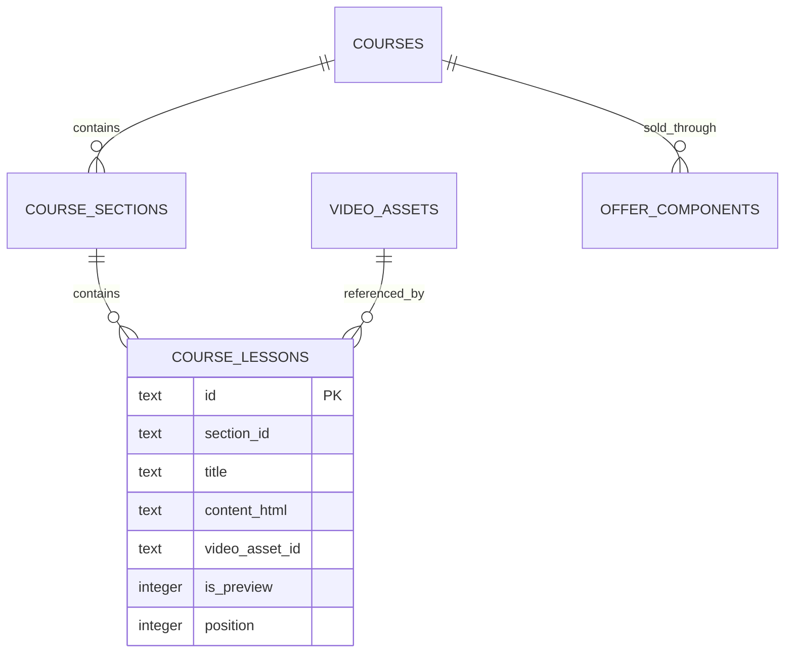
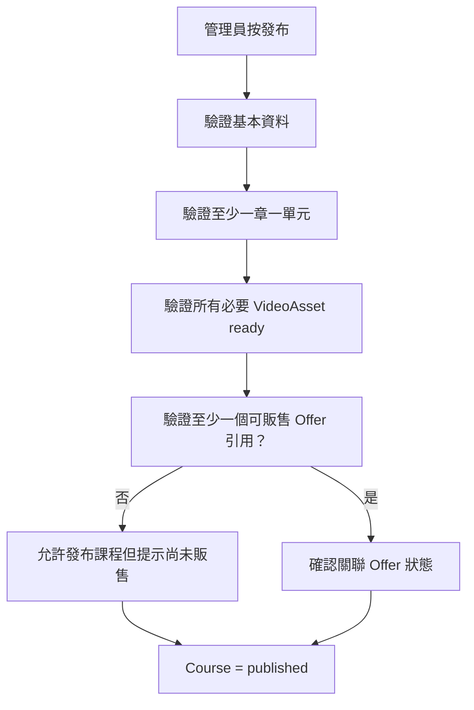

# Phase 5：課程編輯、章節單元與商品頁設計

日期：2026-07-29

## 原始需求

- 管理員可以新增課程。
- 課程頁內容可以使用 HTML 編輯。
- 課程包含章節、單元與影片。
- 從 phase4 影片庫選擇已完成轉檔的影片。
- 課程商品頁需要比一般實體商品更多欄位，可參考成熟線上課程平台的資訊層次。
- 課程可以被一個或多個商品 Offer 授予。

## 需求理解

本階段把 Course 從 phase2 的最小骨架擴充為可發布的教學內容。Course 和 Product
仍然分離：

- Course 編輯器負責「學什麼、怎麼教、有哪些單元」。
- Product 編輯器負責「賣多少錢、有哪些方案、搭配哪些實體品」。
- 商品頁可以讀取關聯 Course 的公開資料，但不複製一份課程內容到 Product。

## 課程資訊架構

### 基本資料

- 課程名稱
- slug
- 短摘要
- 課程封面
- 講師名稱與介紹
- 難度
- 授課語言
- 狀態：draft / published / archived

### 銷售與理解所需內容

- 適合對象
- 學習成果
- 先備知識
- 需要準備的工具或材料
- 完整課程介紹 HTML
- 課程章節與單元清單
- 總時數與單元數（由單元與影片推導）
- 是否提供試看單元

### 不在第一版

- 評價與星等
- 作業批改
- 討論區
- 問答
- 證書
- 班級開課日期
- 多講師協作權限

## 編輯器版面

```text
課程標頭
  [草稿] 水彩花卉入門
  [預覽] [發布]

左側主內容
  基本資料
  課程介紹（HTML）
  適合對象／學習成果／準備事項
  課程大綱
    第一章 基礎
      1-1 工具介紹       [影片 ready] [試看]
      1-2 調色練習       [影片 ready]
    第二章 實作
      2-1 花瓣層次       [尚未選影片]

右側摘要
  封面
  講師
  難度／語言
  12 個單元・3 小時 24 分
  被 2 個商品方案使用
```

章節與單元支援拖曳排序，但儲存時由後端正規化 position，不信任前端傳入重複或巨大
排序值。

## Course、Lesson 與 VideoAsset



單元可以：

- 只有 HTML。
- 只有影片。
- 同時有 HTML 與影片。

VideoAsset 必須為 `ready` 才能儲存為可發布單元的影片。failed/processing asset 可以
暫存在編輯器草稿選擇中，但課程發布檢查必須拒絕。

## HTML 設計

管理端使用受控的 rich text editor，資料庫保存經過清理的 HTML。

允許的內容：

- 標題、段落、清單、引用。
- 粗體、斜體、連結。
- 圖片庫中的圖片。
- 表格與水平線。

拒絕：

- `<script>`、事件屬性、iframe。
- 任意 style。
- `javascript:` URL。
- 外部追蹤圖與未允許的 embed。

清理必須在後端執行；前端 editor 的輸出限制只改善操作，不是安全邊界。

## 發布流程



Course 可以先發布作預覽，但只有 active Product + enabled Offer 才會出現在商城。
反過來，Offer 若引用 draft/archived Course 則不能啟用或上架。

## 商品頁整合

商品詳情若 `containsCourse`，增加課程區塊：

```text
你將學會
適合對象
課程介紹
課程大綱
講師介紹
課程資訊
  12 個單元
  3 小時 24 分
  永久觀看
  中文

方案選擇
  線上版
  課程＋材料包
```

若 Offer 含多門課程，顯示「此方案包含」清單；頁面主文不能任意選其中一門覆蓋其他
課程，可使用 bundle 摘要並連到各課程介紹。

## 試看設計

- `course_lessons.is_preview` 表示未購買者可觀看。
- 試看仍透過 phase6 Playback Gateway 發短效播放 session。
- 公開 Course API 只回傳試看單元的公開內容；其他單元只回標題、時長和鎖定狀態。
- 試看不能直接公開 R2 URL。

## 變更與封存

- Course 被購買後仍可增加、調整或更換單元。
- 已購買者預設取得 Course 的目前版本，不把每次課程內容複製到 entitlement。
- 刪除被 Lesson 引用的 VideoAsset 必須拒絕；可先替換影片再封存。
- 封存 Course 阻止新販售，但既有 entitlement 是否可繼續觀看由 phase7 的營運政策決定；
  預設繼續。

## 本階段不做

- 不做會員「我的課程」。
- 不開放正式會員播放。
- 不做觀看進度。
- 不做 DRM。
- 不做評價、作業、討論或證書。
