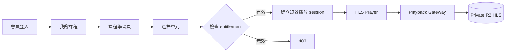
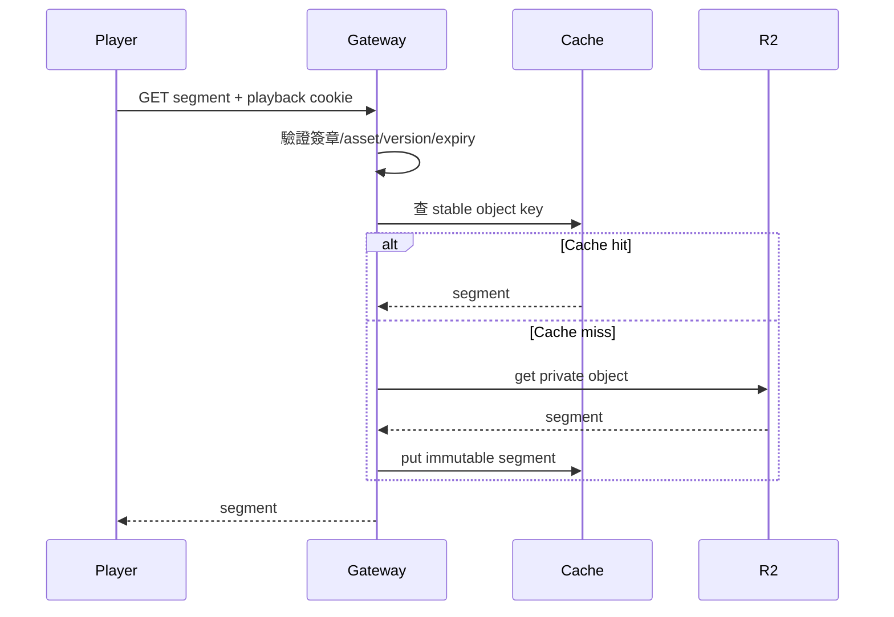
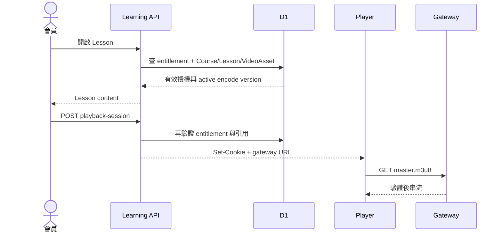

# Phase 6：會員課程中心與授權播放設計

日期：2026-07-29

## 原始需求

- 購買課程後，會員要有「我的課程」可以觀看。
- 必須登入且確實購買過該課程。
- HLS playlist 與分片不能因為取得一次 URL 就永久分享。
- 影片保存在 private R2，並透過 Cloudflare CDN 降低來源讀取。
- 支援課程目錄、目前單元與觀看進度。

## 安全邊界

本方案能阻止：

- 未登入訪客直接存取影片。
- 已登入但未購買的會員播放。
- 分享單一 m3u8 URL 給另一個沒有 session 的人。
- 永久使用過期播放連結。
- 猜測 R2 object key 後直接下載 private bucket。

本方案不能保證：

- 已合法取得播放權的會員無法錄影。
- 技術使用者無法在播放期間保存已解碼的 HLS segments。
- 一般 HLS 能達到 Widevine、FairPlay、PlayReady 等 Multi-DRM 強度。

因此 phase6 的目標是可靠存取控制與降低隨意分享，不宣稱「完全無法下載」。

## 會員學習流程



## 我的課程

資料來源為 `course_entitlements`，不是掃描歷史訂單。

課程卡顯示：

- 課程封面與名稱。
- 授權期限：永久／「觀看後 N 天內有效」／已啟動則顯示到期日。
- 已完成單元數／總單元數。
- 最近觀看單元。
- 「繼續學習」。

無課程時顯示商城課程入口；被撤銷或過期課程不列入有效清單，但會員可以在訂單頁
看到原始購買紀錄，觀看進度也不會被刪除。archived Course 若仍有有效 entitlement 則
照常列出並可播放。

## 課程學習頁

```text
課程名稱

主區域
  影片播放器
  單元標題
  單元 HTML
  [上一單元] [標記完成] [下一單元]

側欄
  第一章
    ✓ 工具介紹
    ● 調色練習
    ○ 花瓣層次
```

手機版將目錄收合到播放器下方，避免窄畫面同時保留兩欄。

## Playback Gateway

HLS object 不直接使用 R2 public URL。播放器只存取：

```text
https://api.luma-studio.tw/course-media/{assetId}/{encodeVersion}/master.m3u8
```

Gateway 流程：

1. 會員 API 先驗證 customer session。
2. 查詢有效 entitlement。
3. 驗證 Lesson 確實引用此 VideoAsset。
4. 核發短效、簽章的 playback session。
5. session 優先放在 Secure、HttpOnly、限定 path 的 cookie，不把長效權限放進 URL。
6. HLS Player 使用 credentials 請求 manifest 與 segments。
7. Gateway 每次驗證簽章、到期時間、asset id 與 encode version。
8. 驗證成功後才從 private R2 或 Cache 取 object。

### 期限在這裡才開始算

phase3 付款時只把 `access_days` 寫進 entitlement，不算到期日。真正的倒數在 Gateway 前一步：
會員第一次成功取得受保護 Lesson 的 playback session 時，以條件 UPDATE 寫入 `first_viewed_at`
與 `expires_at`。條件包含 `first_viewed_at IS NULL`，所以併發請求與後續 refresh 都只會成功一次。

只有受保護內容會啟動。逛商品頁、開「我的課程」、看課程目錄、播試看片段都不算開始觀看，
避免會員還沒真的開始上課就被扣時間。

### 為什麼不每個 segment 查 D1

一支影片可能產生數百次 segment request。每次查 entitlement 會提高延遲與 D1 成本。
在建立 playback session 時查一次 D1，之後用短效簽章驗證：

- token 到期後重新檢查 entitlement。
- 撤銷權限最晚在短效 token 到期時生效。
- manifest 與 segment 驗證不需要 D1 round trip。

### Cookie 而不是只用 Query Token

Query token 會出現在播放器、日誌與分享 URL。HttpOnly cookie 不能被一般 JavaScript
讀取，分享 m3u8 URL 也不會附帶另一個會員的 cookie。

若跨 origin 播放器限制迫使 query token，必須使用極短期限、綁定 asset/version，
並避免寫入分析與錯誤日誌；實作前優先完成 same-site credentialed request。

## HLS 路徑與快取

phase4 的 playlist 使用相對路徑，因此 Gateway 可將：

```text
/course-media/{asset}/{version}/720p/segment-000001.m4s
```

映射到：

```text
videos/{asset}/{version}/720p/segment-000001.m4s
```

### CDN Cache 原則

- 先驗證 playback session，再讀共享快取。
- 快取 key 使用穩定的 asset/version/object path，不含會員 token。
- 不把 401/403 回應快取。
- versioned segment 可長時間 cache。
- manifest 可較短 cache，或依 immutable encode version 快取。
- Cache 命中不代表跳過授權。



## 播放 Session

簽章 payload 至少包含：

```text
version
customer_id
course_id
lesson_id
video_asset_id
encode_version
issued_at
expires_at
nonce
```

token 使用伺服器 secret HMAC 簽章；不可只 base64。預設有效期以足夠播放且能快速撤銷
為原則，建議先以 10～20 分鐘實測。播放器在到期前透過會員 API refresh。

## 試看單元

試看仍走相同 Gateway：

- 建立 session 時不要求 entitlement，但必須確認 `is_preview = true`。
- token 標記 preview scope，只允許指定 Lesson/VideoAsset。
- preview session **不得**寫入 `first_viewed_at`，即使該會員已擁有這門課。
- 不將 R2 路徑公開。
- 可加上較嚴格 rate limit。

## 觀看進度

### 資料模型

`course_lesson_progress`：

| 欄位 | 說明 |
| --- | --- |
| `customer_id` | 會員 |
| `course_id` | 課程 |
| `lesson_id` | 單元 |
| `position_seconds` | 最近位置 |
| `completed_at` | 完成時間 |
| `updated_at` | 最近更新 |

唯一鍵 `(customer_id, lesson_id)`。

### 寫入節流

- 前端不應每秒寫 D1。
- 建議每 15～30 秒、pause、ended、切換單元時寫入。
- API 驗證 position 不超過影片合理長度。
- 完成可以由 ended 或觀看比例門檻觸發，但會員仍可手動標記。

## 權限流程



## 本階段不做

- 不做 Multi-DRM。
- 不做離線下載。
- 不做逐幀浮水印或影片內嵌會員資訊。
- 不做作業、討論與證書。
- 不做多裝置同時觀看限制；只保留觀測資料供 phase7 決策。
