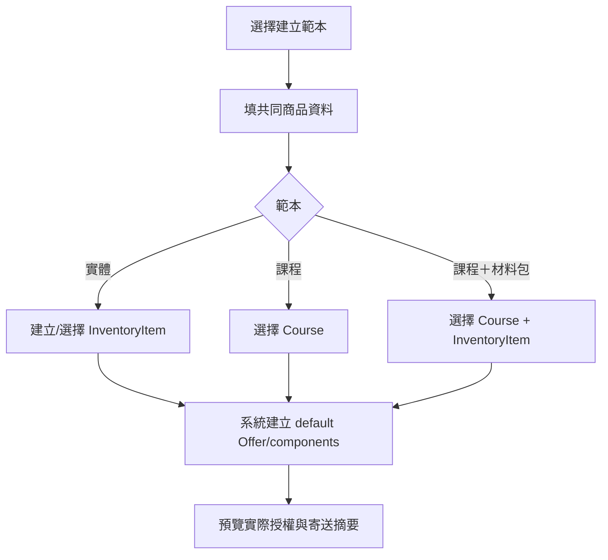
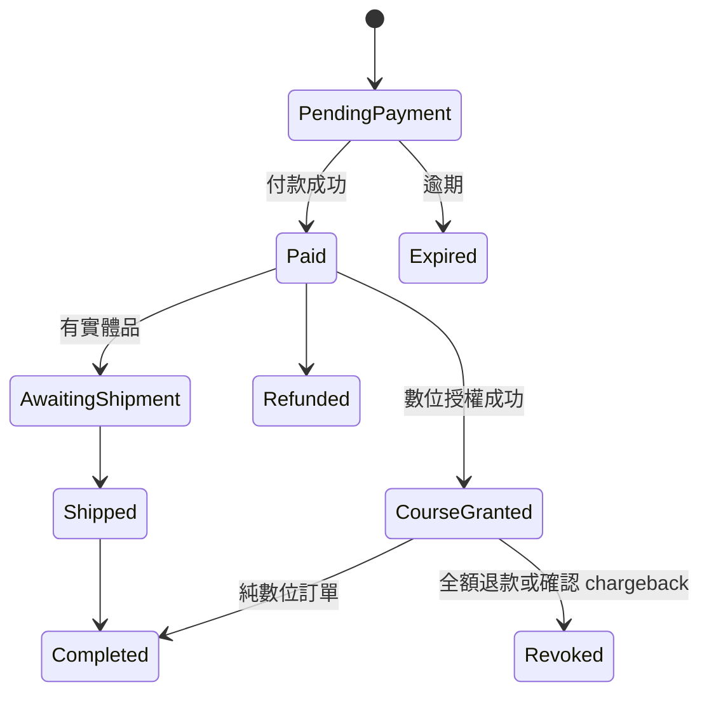
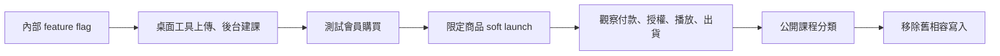

# Phase 7：商城與課程整合、營運流程及上線補強

日期：2026-07-29

## 原始需求

完成商品、課程、實體材料包、付款、出貨與會員觀看後，還需要一個正式開賣前的整合
階段，處理不是 happy path 的營運情境：

- 後台新增商品要簡單，不暴露底層 component 複雜度。
- 課程＋材料包要能正確收地址、扣庫存、授權與出貨。
- 取消、退款、補寄、補發或撤銷觀看權要有明確流程。
- 影片、課程、商品與庫存被引用時不能誤刪。
- 需要成本、錯誤、積壓、授權與播放的可觀測性。
- 舊欄位與相容程式要在確認安全後清理。

## 需求理解

phase7 不再新增另一套核心模型，而是：

1. 用範本包裝 phase1～phase3 的彈性。
2. 補齊退款、出貨與授權的狀態協調。
3. 建立管理工具、reconciliation、稽核與 runbook。
4. 完成正式上線、回滾與成本門檻。

## 商品建立範本

後台提供三個主要入口，但底層都建立 Offer components：

| 範本 | 預設內容 | 後台主要欄位 |
| --- | --- | --- |
| 實體商品 | 一筆 InventoryItem | 售價、SKU、庫存、配送 |
| 線上課程 | 一筆 Course | 售價、觀看期限 |
| 課程＋材料包 | Course + InventoryItem | 售價、課程、材料包、庫存 |

另提供「進階組合」給多課程或多實體內容，不把所有人一開始就丟進 component editor。

範本只影響建立體驗，不儲存 `product_type`。

## 訂單營運狀態

一張混合訂單同時有三種狀態：

- Payment：pending / paid / refunded / disputed。
- Digital fulfillment：pending / fulfilled / revoked。
- Physical fulfillment：pending / shipped / completed / returned。

不要再嘗試用單一 `orders.status` 完整表達所有組合。`orders.status` 保留顧客可理解的
整體狀態，細節由 fulfillment 顯示。純數位訂單在全部 digital fulfillment 與 entitlement
provision 成功後自動轉 `completed`；混合訂單付款後立即開通課程，但整體狀態仍等實體
`shipped -> completed`。

## 取消、退款與撤銷

| 情境 | 實體庫存 | 課程授權 | 訂單／稽核 |
| --- | --- | --- | --- |
| pending 取消／逾期 | 立即回補 | 尚未建立；釋放 purchase lock | cancelled/expired |
| paid、尚未出貨，全額退款 | 依政策回補 | 撤銷該訂單 course sources | 記錄退款與原因 |
| paid、已出貨後退款 | 收到退貨後回補 | 撤銷該訂單 course sources | 不自動假設退貨完成 |
| 只退實體 component | 依政策回補 | 不動 | 記錄僅實體退款 |
| 部分退款 | 依指定項目 | 只撤銷被點名的 course fulfillment | 未點名即不撤銷 |
| 只補寄材料 | 新增補寄 fulfillment，不重複課程授權 | 不變 | 記錄操作人 |
| 授權漏發 | 不變 | 冪等補發 | 記錄來源與原因 |
| chargeback（已確認） | 不自動改庫存 | 撤銷該訂單 course sources | 顯示需人工確認金流 |

依 2026-07-30 決策，全額退款、已付款取消與已確認 chargeback **自動撤銷**該訂單的
course fulfillment sources。只有當該 entitlement 已無其他未撤銷 source 時，才寫入
entitlement 的 `revoked_at`。撤銷收回 Course／Lesson 存取與影片播放授權，不刪除 Course、
Lesson、影片、觀看進度、訂單或 audit，因此 restore 隨時可行。撤銷同時釋放
`course_offer_purchase_locks`，會員可以重新購買。

部分退款不從訂單金額推測，必須由操作者明確點名受影響的 course fulfillment。

## 封存與刪除規則

| 實體 | 有引用時 |
| --- | --- |
| Product | 可封存；訂單快照保留 |
| Offer | 停用；有 pending reservation 時不可硬刪 |
| InventoryItem | 封存；訂單與 Offer reference 保留 |
| Course | 封存；阻止新販售與新授權，既有有效 entitlement 可繼續觀看 |
| VideoAsset | 有 Lesson reference 時不可刪；先替換 |
| HLS encode version | 非 active 且超過 rollback 保留期才可刪 |
| Source video | 依保留政策且已有可驗證 ready encode 才可刪 |

所有永久刪除操作先顯示 references，並需要二次確認與 audit。

## 運費與數量政策

- 純課程不收運費。
- `shippingSubtotal` 只包含有實體 component 的 Offer line。
- 混合 Offer 的整筆售價計入 shippingSubtotal，不嘗試虛構課程與材料的價格拆分。
- 含課程的 Offer quantity 固定 1，且會員已持有該 Course 的有效 entitlement 時不得再次結帳。
- 多份實體材料需求透過 component quantity 表達。
- 贈送課程建立 `gift` entitlement source 與 recipient，不建立零元 OrderItem，也不解除
  quantity 限制硬塞進同帳號。

## 觀看期限

- 預設永久：`access_days IS NULL`。
- 期限型：付款時只記 `access_days`，倒數由會員**第一次成功播放**受保護單元啟動，寫入
  `first_viewed_at` 與 `expires_at`。
- 管理端顯示三種狀態：永久、尚未啟動（顯示「觀看後 N 天」）、已啟動（顯示到期日）。
- 補發不得意外延長已啟動的期限；需要延長時使用明確的營運操作並寫 audit。

## 管理工具

### Reconciliation

至少提供：

- paid 但 course fulfillment pending。
- pending 已逾期但庫存尚未回補。
- pending 已結束但 purchase lock 未釋放，或 lock 指向不存在／已撤銷來源的訂單。
- active entitlement 的來源 order 不存在或狀態異常。
- entitlement 所有 source 都已撤銷但 entitlement 仍未撤銷。
- 期限型 entitlement 有 `expires_at` 卻沒有 `first_viewed_at`（或反之）。
- ready VideoAsset 缺少 master/segment。
- processing job 超過合理時間。
- CourseLesson 引用非 ready/不存在 asset。

### 稽核

記錄：

- 商品 component 變更。
- 庫存人工調整。
- 訂單狀態與補寄。
- entitlement 補發、撤銷、恢復、gift 授與。
- 期限倒數啟動（`first_viewed_at` 寫入）。
- Course publish/archive。
- Video retry/archive/delete。

## 監控與成本

| 指標 | 告警方向 |
| --- | --- |
| Presign 核發失敗 | 憑證過期或設定錯誤 |
| Import 驗證缺漏 | 上傳不完整 |
| 卡在 uploading 的 asset 年齡 | 上傳中斷沒人回來收尾 |
| 桌面工具 token 兌換失敗 | 時鐘偏移，或有人在猜配對碼 |
| Ready validation failure | R2 寫入不完整 |
| Playback 5xx | 會員無法觀看 |
| Playback 401/403 rate | session 或攻擊異常 |
| Entitlement reconciliation count | 付款後漏授權 |
| R2 source/output bytes | 儲存成本偏移 |
| Cache hit ratio | R2 讀取與延遲 |

成本報表至少分：

- 原始影片儲存。
- HLS 輸出儲存。
- R2 Class A/B operations。
- Worker requests。

轉檔的 CPU 落在管理員的機器上，帳單上看不到，也不需要監控。

## 備份與復原

- D1 備份必須包含 Course、Entitlement、Progress、Video metadata。
- R2 影片需要獨立備份或明確接受「可由 source 重建」的策略。
- 若 source 會刪除，HLS output 就不再是可隨時重建，必須有第二份保存或接受遺失風險。
- Runbook 要能從 D1 asset 記錄定位 R2 keys，但備份檔與 log 不包含 presigned URL 或桌面工具 token。
- 原始檔留著的話，HLS 輸出可以重建 —— 但重建需要一台裝著桌面工具的機器，不是一個雲端按鈕。復原時間要照這個算。

## 上線策略

先上架一個純課程和一個課程＋材料包，不一次搬入所有內容。觀察完整付款、授權、
播放、庫存與出貨後再擴大。

## 本階段不做

- 不做 Multi-DRM。
- 不做訂閱制。
- 不做多人席次、企業採購。
- 不做多倉、多包裹自動拆單。
- 不做作業批改、討論區與證書。
